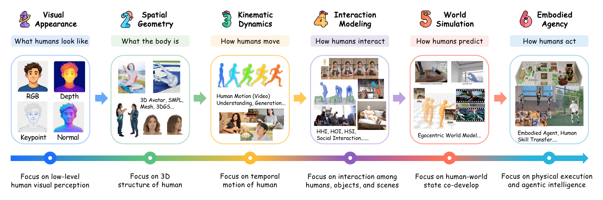

<h1 align="center">&nbsp; Human-Centric AI Resources</h1>

<p align="center"><b>An open, community-driven hub for human-centric AI.</b></p>

<p align="center"><a href="https://awesome.re"></a> <a href="https://cseeyangchen.github.io/Human-Centric-AI/homepage/"></a>  <a href="https://github.com/cseeyangchen/Human-Centric-AI"></a> <a href="https://github.com/cseeyangchen/Human-Centric-AI/forks"></a>  <a href="https://github.com/cseeyangchen/Human-Centric-AI/pulls"></a> <a href="https://github.com/cseeyangchen/Human-Centric-AI/commits/main"></a></p>

<p align="center">
  
</p>

Human-Centric AI Resources is an open and evolving hub that brings together academic knowledge, research infrastructure, community learning materials, and curated literature across human-centric AI. The accompanying survey provides a structured perspective through its six-level human context taxonomy, while this repository extends beyond the survey to support broader resource discovery and community curation.

> [!TIP]
> **Join the community.** We welcome everyone interested in human-centric AI to help maintain and enrich this open resource hub. If you are interested in getting involved, feel free to contact us using the details at the bottom of this page.

<a id="news"></a>

## 📢 News

- **2026-08-10:** Our [project homepage](https://cseeyangchen.github.io/Human-Centric-AI/homepage/) is now live.
- **2026-08-08:** First resource release.

## 🧭 Contents

- [News](#news)
- [Academic Knowledge](#academic-knowledge)
- [Research Infrastructure](#research-infrastructure)
- [Community Learning Hubs](#community-learning-hubs)
- [Citation](#citation)
- [Contact](#contact)
- [License](#license)

<a id="academic-knowledge"></a>

## 🎓 Academic Knowledge

- 🔭 [**Awesome Research**](resources/awesome-research.md)
- 🎟️ [**Workshop Collections**](resources/workshop-collections.md)
- 📖 [**Open Courseware**](resources/open-courseware.md)
- 🎙️ [**Academic Presentations**](resources/academic-presentations.md)

<a id="research-infrastructure"></a>

## 🧰 Research Infrastructure

- 🧍 [**Human Models and Toolkits**](resources/human-models-and-toolkits.md)
- 🔧 [**Practical Tools**](resources/practical-tools.md)
- 🧪 [**Simulation and Evaluation**](resources/simulation-and-evaluation.md)

<a id="community-learning-hubs"></a>

## 🌐 Community Learning Hubs

- 🧑 [**LearningHumans**](https://github.com/IsshikiHugh/LearningHumans)
- 🏃 [**LearningMotion**](https://github.com/phj128/LearningMotion)
- 📘 [**Meshcapade Body Modeling Wiki**](https://github.com/Meshcapade/wiki)

<a id="citation"></a>

## ✍️ Citation

If this resource collection is useful in your research, please cite the accompanying survey:

```bibtex

```

<a id="contact"></a>

## 📧 Contact

For questions, suggestions, or collaboration inquiries, please contact the project lead, **Yang Chen**:

- **Email:** [cs-yang.chen@connect.polyu.hk](mailto:cs-yang.chen@connect.polyu.hk)
- **WeChat:** `cs-yangchen` (please include your name, institutional affiliation, and reason for contacting in the friend request)

<a id="license"></a>

## 📜 License

Source code is licensed under the [MIT License](LICENSES/MIT.txt). Original documentation, curated resource metadata, and the authorized survey figures are licensed under [CC BY 4.0](LICENSES/CC-BY-4.0.txt). Logos, unlisted visual assets, and third-party materials may be subject to separate terms. See [LICENSE](LICENSE) and [Third-Party Notices](homepage/THIRD_PARTY_NOTICES.md) for the complete scope.

---

<p align="center">
  <strong>⭐ If this project helps you, please give us a Star!</strong><br>
  <sub>Curated and maintained by <a href="https://lumen-lab-polyu.github.io/"><strong>Lumen Lab</strong></a> @ <a href="https://www.polyu.edu.hk/"><strong>The Hong Kong Polytechnic University</strong></a></sub>
</p>
