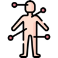

<a href="../README.md">&larr; Back to the main README</a>

# 📚 Awesome Human-Centric AI Survey Resources

This page brings together the papers, datasets, and benchmarks organized in **Human-Centric Intelligence in the Era of Foundation Models: A Survey**.

## Contents

- [Paper Resources](#paper-resources)
- [Datasets and Benchmarks](#datasets-and-benchmarks)

## Paper Resources

The paper index combines works cited in the Chapter 4--6 method discussions, works listed in the corresponding method tables, and verified post-survey updates. Each level and subcategory is collapsed by default for faster navigation.

### Contents

- [I. Visual Appearance](#visual-appearance)
- [II. Spatial Geometry](#spatial-geometry)
- [III. Kinematic Dynamics](#kinematic-dynamics)
- [IV. Interaction Modeling](#interaction-modeling)
- [V. World Simulation](#world-simulation)
- [VI. Embodied Agency](#embodied-agency)

 &nbsp; <b>I. Visual Appearance</b>

> 

> 
<b>I.1</b> &nbsp; Generalist Human Perception

>
> | Method | Paper | Venue | Paper Page | Website |
> |---|---|:---:|:---:|:---:|
> | Sapiens2 | Sapiens2 | ICLR 2026 | [:page_facing_up:](https://openreview.net/forum?id=IVAlYCqdvW "Paper page") | [:octocat:](https://github.com/facebookresearch/sapiens2 "GitHub") |
> | THFM | THFM: A Unified Video Foundation Model for 4D Human Perception and Beyond | arXiv 2026 | [:page_facing_up:](https://arxiv.org/abs/2603.25892 "Paper page") | - |
> | UniF^2ace | UniF^2ace: A Unified Fine-grained Face Understanding and Generation Model | ICLR 2026 | [:page_facing_up:](https://arxiv.org/abs/2503.08120 "Paper page") | [:octocat:](https://github.com/tulvgengenr/UniF2ace "GitHub") |
> | DAViD | DAViD: Data-efficient and Accurate Vision Models from Synthetic Data | ICCV 2025 | [:page_facing_up:](https://openaccess.thecvf.com/content/ICCV2025/html/Saleh_DAViD_Data-efficient_and_Accurate_Vision_Models_from_Synthetic_Data_ICCV_2025_paper.html "Paper page") | [:octocat:](https://github.com/microsoft/DAViD "GitHub") |
> | FaceXFormer | FaceXFormer: A Unified Transformer for Facial Analysis | ICCV 2025 | [:page_facing_up:](https://openaccess.thecvf.com/content/ICCV2025/html/Narayan_FaceXFormer_A_Unified_Transformer_for_Facial_Analysis_ICCV_2025_paper.html "Paper page") | [:octocat:](https://github.com/Kartik-3004/facexformer "GitHub") |
> | FSFM | FSFM: A Generalizable Face Security Foundation Model via Self-Supervised Facial Representation Learning | CVPR 2025 | [:page_facing_up:](https://openaccess.thecvf.com/content/CVPR2025/html/Wang_FSFM_A_Generalizable_Face_Security_Foundation_Model_via_Self-Supervised_Facial_CVPR_2025_paper.html "Paper page") | [:octocat:](https://github.com/wolo-wolo/FSFM-CVPR25 "GitHub") |
> | GroundingFace | GroundingFace: Fine-Grained Face Understanding via Pixel Grounding Multimodal Large Language Model | CVPR 2025 | [:page_facing_up:](http://openaccess.thecvf.com/content/CVPR2025/html/Han_GroundingFace_Fine-grained_Face_Understanding_via_Pixel_Grounding_Multimodal_Large_Language_CVPR_2025_paper.html "Paper page") | - |
> | Hulk | Hulk: A Universal Knowledge Translator for Human-Centric Tasks | TPAMI 2025 | [:page_facing_up:](https://arxiv.org/abs/2312.01697 "Paper page") | [:octocat:](https://github.com/OpenGVLab/Hulk "GitHub") |
> | L-Man | L-Man: A Large Multi-modal Model Unifying Human-centric Tasks | AAAI 2025 | [:page_facing_up:](https://ojs.aaai.org/index.php/AAAI/article/view/33206 "Paper page") | - |
> | Face-MLLM | Face-MLLM: A Large Face Perception Model | arXiv 2024 | [:page_facing_up:](https://arxiv.org/abs/2410.20717 "Paper page") | - |
> | Sapiens | Sapiens: Foundation for Human Vision Models | ECCV 2024 | [:page_facing_up:](https://link.springer.com/chapter/10.1007/978-3-031-73235-5_12 "Paper page") | [:octocat:](https://github.com/facebookresearch/sapiens "GitHub") |
> | HAP | HAP: Structure-Aware Masked Image Modeling for Human-Centric Perception | NeurIPS 2023 | [:page_facing_up:](https://proceedings.neurips.cc/paper_files/paper/2023/hash/9ed1c94a6c87276f25ebb65231c86c3e-Abstract-Conference.html "Paper page") | [:octocat:](https://github.com/junkunyuan/HAP "GitHub") |
> | HumanBench | HumanBench: Towards General Human-Centric Perception with Projector Assisted Pretraining | CVPR 2023 | [:page_facing_up:](http://openaccess.thecvf.com/content/CVPR2023/html/Tang_HumanBench_Towards_General_Human-Centric_Perception_With_Projector_Assisted_Pretraining_CVPR_2023_paper.html "Paper page") | [:octocat:](https://github.com/OpenGVLab/HumanBench "GitHub") |
>
> 

> 

> 
<b>I.2</b> &nbsp; Discriminative Identity Understanding

>
> | Method | Paper | Venue | Paper Page | Website |
> |---|---|:---:|:---:|:---:|
> | SapiensID 2.0 | SapiensID 2.0: Aligning Human Recognition Foundation Models with Human Perception | arXiv 2026 | [:page_facing_up:](https://arxiv.org/abs/2608.10497 "Paper page") | - |
> | ChatReID | ChatReID: Open-ended Interactive Person Retrieval via Hierarchical Progressive Tuning for Vision Language Models | ICCV 2025 | [:page_facing_up:](https://openaccess.thecvf.com/content/ICCV2025/papers/Niu_ChatReID_Open-ended_Interactive_Person_Retrieval_via_Hierarchical_Progressive_Tuning_for_ICCV_2025_paper.pdf "Paper page") | - |
> | GIF | GIF: Generative Inspiration for Face Recognition at Scale | CVPR 2025 | [:page_facing_up:](https://openaccess.thecvf.com/content/CVPR2025/html/Ebrahimi_GIF_Generative_Inspiration_for_Face_Recognition_at_Scale_CVPR_2025_paper.html "Paper page") | - |
> | IRM++ | Instruct-reid++: Towards universal purpose instruction-guided person re-identification | TPAMI 2025 | [:page_facing_up:](https://arxiv.org/abs/2405.17790 "Paper page") | [:octocat:](https://github.com/hwz-zju/Instruct-ReID "GitHub") |
> | LVFace | LVFace: Progressive Cluster Optimization for Large Vision Models in Face Recognition | ICCV 2025 | [:page_facing_up:](https://openaccess.thecvf.com/content/ICCV2025/html/You_LVFace_Progressive_Cluster_Optimization_for_Large_Vision_Models_in_Face_ICCV_2025_paper.html "Paper page") | [:octocat:](https://github.com/bytedance/LVFace "GitHub") |
> | RexSeek | Referring to Any Person | ICCV 2025 | [:page_facing_up:](https://openaccess.thecvf.com/content/ICCV2025/html/Jiang_Referring_to_Any_Person_ICCV_2025_paper.html "Paper page") | [:octocat:](https://github.com/IDEA-Research/RexSeek "GitHub") |
> | ReID5o | ReID5o: Achieving Omni Multi-modal Person Re-identification in a Single Model | NeurIPS 2025 | [:page_facing_up:](https://proceedings.neurips.cc/paper_files/paper/2025/hash/4d4dbc5c955c5d273eed12d565335068-Abstract-Conference.html "Paper page") | [:octocat:](https://github.com/Zplusdragon/ReID5o_ORBench "GitHub") |
> | SapiensID | SapiensID: Foundation for Human Recognition | CVPR 2025 | [:page_facing_up:](https://openaccess.thecvf.com/content/CVPR2025/html/Kim_SapiensID_Foundation_for_Human_Recognition_CVPR_2025_paper.html "Paper page") | [:octocat:](https://github.com/mk-minchul/sapiensid "GitHub") |
> | IRM | Instruct-ReID: A Multi-purpose Person Re-identification Task with Instructions | CVPR 2024 | [:page_facing_up:](https://openaccess.thecvf.com/content/CVPR2024/html/He_Instruct-ReID_A_Multi-purpose_Person_Re-identification_Task_with_Instructions_CVPR_2024_paper.html "Paper page") | [:octocat:](https://github.com/hwz-zju/Instruct-ReID "GitHub") |
> | PLIP | PLIP: Language-Image Pre-training for Person Representation Learning | NeurIPS 2024 | [:page_facing_up:](https://proceedings.neurips.cc/paper_files/paper/2024/hash/510ad3018bbdc5b6e3b10646e2e35771-Abstract-Conference.html "Paper page") | [:octocat:](https://github.com/zplusdragon/PLIP "GitHub") |
> | MMPedestron | When Pedestrian Detection Meets Multi-modal Learning: Generalist Model and Benchmark Dataset | ECCV 2024 | [:page_facing_up:](https://arxiv.org/abs/2407.10125 "Paper page") | [:octocat:](https://github.com/BubblyYi/MMPedestron "GitHub") |
>
> 

> 

> 
<b>I.3</b> &nbsp; Controllable Human Generation

>
> | Method | Paper | Venue | Paper Page | Website |
> |---|---|:---:|:---:|:---:|
> | Archon | Archon: A Unified Multimodal Model for Holistic Digital Human Generation | CVPR 2026 | [:page_facing_up:](https://openaccess.thecvf.com/content/CVPR2026/html/Bao_Archon_A_Unified_Multimodal_Model_for_Holistic_Digital_Human_Generation_CVPR_2026_paper.html "Paper page") | [:house:](https://zju3dv.github.io/archon/ "Homepage") |
> | InstructVVT | InstructVVT: Instruction-Driven Video Virtual Try-On without Auxiliary Spatial Priors | arXiv 2026 | [:page_facing_up:](https://arxiv.org/abs/2608.14070 "Paper page") | [:house:](https://shaodingbao.github.io/InstructVVT/ "Homepage") [:octocat:](https://github.com/ShaoDingBao/InstructVVT "GitHub") |
> | Oxygen-TryOn | Oxygen-TryOn: Fashion-Native Foundation Model for Any-item Virtual Try-On | arXiv 2026 | [:page_facing_up:](https://arxiv.org/abs/2607.21694 "Paper page") | [:house:](https://oxygenvision.github.io/Oxygen-TryOn/ "Homepage") |
> | Tstars-Tryon 1.0 | Tstars-Tryon 1.0: Robust and Realistic Virtual Try-On for Diverse Fashion Items | arXiv 2026 | [:page_facing_up:](https://arxiv.org/abs/2604.19748 "Paper page") | [🤗](https://huggingface.co/datasets/TaobaoTmall-AlgorithmProducts/Tstars-VTON "Hugging Face") |
> | DreamActor-M1 | DreamActor-M1: Holistic, Expressive and Robust Human Image Animation with Hybrid Guidance | ICCV 2025 | [:page_facing_up:](https://openaccess.thecvf.com/content/ICCV2025/html/Luo_DreamActor-M1_Holistic_Expressive_and_Robust_Human_Image_Animation_with_Hybrid_ICCV_2025_paper.html "Paper page") | [:house:](https://grisoon.github.io/DreamActor-M1/ "Homepage") |
> | FoundHand | FoundHand: Large-Scale Domain-Specific Learning for Controllable Hand Image Generation | CVPR 2025 | [:page_facing_up:](https://openaccess.thecvf.com/content/CVPR2025/html/Chen_FoundHand_Large-Scale_Domain-Specific_Learning_for_Controllable_Hand_Image_Generation_CVPR_2025_paper.html "Paper page") | [:octocat:](https://github.com/arthurchen0518/FoundHand "GitHub") |
> | Visual Persona | Visual Persona: Foundation Model for Full-Body Human Customization | CVPR 2025 | [:page_facing_up:](https://openaccess.thecvf.com/content/CVPR2025/papers/Nam_Visual_Persona_Foundation_Model_for_Full-Body_Human_Customization_CVPR_2025_paper.pdf "Paper page") | [:octocat:](https://github.com/cvlab-kaist/Visual-Persona "GitHub") |
> | Voost | Voost: A Unified and Scalable Diffusion Transformer for Bidirectional Virtual Try-On and Try-Off | SIGGRAPH Asia 2025 | [:page_facing_up:](https://arxiv.org/abs/2508.04825 "Paper page") | [:house:](https://nxnai.github.io/Voost "Homepage") |
> | CosmicMan | CosmicMan: A Text-to-Image Foundation Model for Humans | CVPR 2024 | [:page_facing_up:](https://openaccess.thecvf.com/content/CVPR2024/html/Li_CosmicMan_A_Text-to-Image_Foundation_Model_for_Humans_CVPR_2024_paper.html "Paper page") | [:octocat:](https://github.com/cosmicman-cvpr2024/CosmicMan "GitHub") |
> | UPGPT | UPGPT: Universal Diffusion Model for Person Image Generation, Editing and Pose Transfer | ICCVW 2023 | [:page_facing_up:](https://openaccess.thecvf.com/content/ICCV2023W/CV4Metaverse/html/Cheong_UPGPT_Universal_Diffusion_Model_for_Person_Image_Generation_Editing_and_ICCVW_2023_paper.html "Paper page") | [:octocat:](https://github.com/soon-yau/upgpt "GitHub") |
>
> 

 &nbsp; <b>II. Spatial Geometry</b>

> 

> 
<b>II.1</b> &nbsp; Structured Geometry Modeling

>
> | Method | Paper | Venue | Paper Page | Website |
> |---|---|:---:|:---:|:---:|
> | Anny-Fit | Anny-Fit: All-Age Human Mesh Recovery | CVPR 2026 Findings | [:page_facing_up:](https://arxiv.org/abs/2605.04728 "Paper page") | [:octocat:](https://github.com/naver/anny-fit "GitHub") |
> | DanceHMR | DanceHMR: Hand-Aware Whole-Body Human Mesh Recovery from Monocular Videos | arXiv 2026 | [:page_facing_up:](https://arxiv.org/abs/2605.18102 "Paper page") | [:house:](https://shenwenhao01.github.io/dancehmr/ "Homepage") |
> | DETRAM | DETRAM: End-to-end DEtection, Tracking and Recovery of HumAn Meshes | arXiv 2026 | [:page_facing_up:](https://arxiv.org/abs/2607.09089 "Paper page") | - |
> | EmoteGPT | EmoteGPT: 3D Human Facial Expressions from Natural Language Descriptions | ECCV 2026 | [:page_facing_up:](https://arxiv.org/abs/2607.02674 "Paper page") | [:octocat:](https://github.com/GenIntel/EmoteGPT "GitHub") |
> | Multi-HMR 2 | Multi-HMR 2: Multi-Person Camera-Centric Human Detection, Mesh Recovery and Tracking | arXiv 2026 | [:page_facing_up:](https://arxiv.org/abs/2606.14841 "Paper page") | [:octocat:](https://github.com/naver/multi-hmr2 "GitHub") |
> | PEAR | PEAR: Pixel-Aligned Expressive Human Mesh Recovery | SIGGRAPH 2026 | [:page_facing_up:](https://arxiv.org/abs/2601.22693 "Paper page") | [:octocat:](https://github.com/Pixel-Talk/PEAR "GitHub") |
> | SAM 3D Body | SAM 3D Body: Robust Full-Body Human Mesh Recovery | CVPR 2026 | [:page_facing_up:](https://arxiv.org/abs/2602.15989 "Paper page") | [:octocat:](https://github.com/facebookresearch/sam-3d-body "GitHub") |
> | VLM-GPA | VLM-Guided Group Preference Alignment for Diffusion-based Human Mesh Recovery | CVPR 2026 | [:page_facing_up:](https://arxiv.org/abs/2602.19180 "Paper page") | - |
> | ContextFace | ContextFace: Generating Facial Expressions from Emotional Contexts | ICCV 2025 | [:page_facing_up:](https://openaccess.thecvf.com/content/ICCV2025/html/Kim_ContextFace_Generating_Facial_Expressions_from_Emotional_Contexts_ICCV_2025_paper.html "Paper page") | [:octocat:](https://github.com/minjung98/ContextFace_ "GitHub") |
> | PromptHMR | PromptHMR: Promptable Human Mesh Recovery | CVPR 2025 | [:page_facing_up:](https://openaccess.thecvf.com/content/CVPR2025/html/Wang_PromptHMR_Promptable_Human_Mesh_Recovery_CVPR_2025_paper.html "Paper page") | [:octocat:](https://github.com/yufu-wang/PromptHMR "GitHub") |
> | SMPLest-X | SMPLest-X: Ultimate Scaling for Expressive Human Pose and Shape Estimation | TPAMI 2025 | [:page_facing_up:](https://ieeexplore.ieee.org/abstract/document/11195771/ "Paper page") | [:octocat:](https://github.com/wqyin/SMPLest-X "GitHub") |
> | UniPose | UniPose: A Unified Multimodal Framework for Human Pose Comprehension, Generation and Editing | CVPR 2025 | [:page_facing_up:](https://openaccess.thecvf.com/content/CVPR2025/html/Li_UniPose_A_Unified_Multimodal_Framework_for_Human_Pose_Comprehension_Generation_CVPR_2025_paper.html "Paper page") | [:octocat:](https://github.com/VIPL-VISMOD/UniPose "GitHub") |
> | ChatPose | Chatpose: Chatting about 3d Human Pose | CVPR 2024 | [:page_facing_up:](https://openaccess.thecvf.com/content/CVPR2024/html/Feng_ChatPose_Chatting_about_3D_Human_Pose_CVPR_2024_paper.html "Paper page") | [:octocat:](https://github.com/yfeng95/PoseGPT "GitHub") |
> | PoseEmbroider | Poseembroider: Towards a 3d, Visual, Semantic-Aware Human Pose Representation | ECCV 2024 | [:page_facing_up:](https://arxiv.org/abs/2409.06535 "Paper page") | [:octocat:](https://github.com/naver/poseembroider "GitHub") |
> | HaMeR | Reconstructing Hands in 3D with Transformers | CVPR 2024 | [:page_facing_up:](http://openaccess.thecvf.com/content/CVPR2024/html/Pavlakos_Reconstructing_Hands_in_3D_with_Transformers_CVPR_2024_paper.html "Paper page") | [:octocat:](https://github.com/geopavlakos/hamer "GitHub") |
> | SMPLer-X | SMPLer-X: Scaling Up Expressive Human Pose and Shape Estimation | NeurIPS 2023 | [:page_facing_up:](https://proceedings.neurips.cc/paper_files/paper/2023/hash/2614947a25d7c435bcd56c51958ddcb1-Abstract-Datasets_and_Benchmarks.html "Paper page") | [:octocat:](https://github.com/caizhongang/SMPLer-X "GitHub") |
>
> 

> 

> 
<b>II.2</b> &nbsp; Renderable Avatar Modeling

>
> | Method | Paper | Venue | Paper Page | Website |
> |---|---|:---:|:---:|:---:|
> | Portrait 3D Presence | Bringing Your Portrait to 3D Presence | CVPR 2026 | [:page_facing_up:](https://openaccess.thecvf.com/content/CVPR2026/html/Zhang_Bringing_Your_Portrait_to_3D_Presence_CVPR_2026_paper.html "Paper page") | - |
> | DreamCharacter-1 | DreamCharacter-1: From 3D Generative Foundation Models to Product-Ready Character Generation | arXiv 2026 | [:page_facing_up:](https://arxiv.org/abs/2607.07817 "Paper page") | [:house:](https://dreamcharacter-x.github.io/ "Homepage") |
> | Face Anything | Face Anything: 4D Face Reconstruction from Any Image Sequence | ECCV 2026 | [:page_facing_up:](https://arxiv.org/abs/2604.19702 "Paper page") | [:house:](https://kocasariumut.github.io/FaceAnything/ "Homepage") |
> | FiCA | FiCA: Feed-forward instant Gaussian Codec Avatars from a Single Portrait Image | arXiv 2026 | [:page_facing_up:](https://arxiv.org/abs/2606.24232 "Paper page") | [:house:](https://kim-youwang.github.io/FiCA "Homepage") |
> | FlexiAvatar | FlexiAvatar: Unified 3D Gaussian Human Avatars Under Arbitrary Body Visibility | ECCV 2026 | [:page_facing_up:](https://arxiv.org/abs/2607.19100 "Paper page") | [:house:](https://yihalem1.github.io/FlexiAvatar/ "Homepage") |
> | GenLCA | GenLCA: 3D Diffusion for Full-Body Avatars from In-the-Wild Videos | ECCV 2026 | [:page_facing_up:](https://arxiv.org/abs/2604.07273 "Paper page") | [:house:](https://onethousandwu.com/GenLCA-Page/ "Homepage") |
> | HumanNOVA | HumanNOVA: Photorealistic, Universal and Rapid 3D Human Avatar Modeling from a Single Image | CVPR 2026 | [:page_facing_up:](https://arxiv.org/abs/2606.02573 "Paper page") | [:octocat:](https://github.com/HumanNOVA/HumanNOVA "GitHub") |
> | LCA | Large-scale Codec Avatars: The Unreasonable Effectiveness of Large-scale Avatar Pretraining | CVPR 2026 | [:page_facing_up:](https://arxiv.org/abs/2604.02320 "Paper page") | [:house:](https://junxuan-li.github.io/lca/ "Homepage") |
> | HeadsUp | Large-Scale High-Quality 3D Gaussian Head Reconstruction from Multi-View Captures | ECCV 2026 | [:page_facing_up:](https://arxiv.org/abs/2605.04035 "Paper page") | [:house:](https://apple.github.io/ml-headsup/ "Homepage") |
> | AniGS | AniGS: Animatable Gaussian Avatar from a Single Image with Inconsistent Gaussian Reconstruction | CVPR 2025 | [:page_facing_up:](https://openaccess.thecvf.com/content/CVPR2025/html/Qiu_AniGS_Animatable_Gaussian_Avatar_from_a_Single_Image_with_Inconsistent_CVPR_2025_paper.html "Paper page") | [:octocat:](https://github.com/aigc3d/AniGS "GitHub") |
> | Avat3r | Avat3r: Large Animatable Gaussian Reconstruction Model for High-fidelity 3D Head Avatars | ICCV 2025 | [:page_facing_up:](https://openaccess.thecvf.com/content/ICCV2025/html/Kirschstein_Avat3r_Large_Animatable_Gaussian_Reconstruction_Model_for_High-fidelity_3D_Head_ICCV_2025_paper.html "Paper page") | [:house:](https://tobias-kirschstein.github.io/avat3r/ "Homepage") |
> | HuGe100K | IDOL: Instant Photorealistic 3D Human Creation from a Single Image | CVPR 2025 | [:page_facing_up:](https://openaccess.thecvf.com/content/CVPR2025/html/Zhuang_IDOL_Instant_Photorealistic_3D_Human_Creation_from_a_Single_Image_CVPR_2025_paper.html "Paper page") | [:octocat:](https://github.com/yiyuzhuang/IDOL "GitHub") |
> | InfiniHuman | InfiniHuman: Realistic 3D Human Creation with Precise Control | SIGGRAPH Asia 2025 | [:page_facing_up:](https://arxiv.org/abs/2510.11650 "Paper page") | [:house:](https://yuxuan-xue.com/infini-human "Homepage") |
> | LHM | LHM: Large Animatable Human Reconstruction Model for Single Image to 3D in Seconds | ICCV 2025 | [:page_facing_up:](https://arxiv.org/abs/2503.10625 "Paper page") | [:octocat:](https://github.com/aigc3d/LHM "GitHub") |
> | LUCAS | LUCAS: Layered Universal Codec Avatars | CVPR 2025 | [:page_facing_up:](http://openaccess.thecvf.com/content/CVPR2025/html/Liu_LUCAS_Layered_Universal_Codec_Avatars_CVPR_2025_paper.html "Paper page") | - |
> | MV-Performer | MV-Performer: Taming Video Diffusion Model for Faithful and Synchronized Multi-view Performer Synthesis | SIGGRAPH Asia 2025 | [:page_facing_up:](https://arxiv.org/abs/2510.07190 "Paper page") | [:octocat:](https://github.com/zyhbili/MV-Performer "GitHub") |
> | Pippo | Pippo: High-Resolution Multi-View Humans from a Single Image | CVPR 2025 | [:page_facing_up:](https://openaccess.thecvf.com/content/CVPR2025/html/Kant_Pippo_High-Resolution_Multi-View_Humans_from_a_Single_Image_CVPR_2025_paper.html "Paper page") | [:octocat:](https://github.com/facebookresearch/pippo "GitHub") |
> | SIGMAN | SIGMAN: Scaling 3D Human Gaussian Generation with Millions of Assets | ICCV 2025 | [:page_facing_up:](https://arxiv.org/abs/2504.06982 "Paper page") | [:house:](https://yyvhang.github.io/SIGMAN_3D/ "Homepage") |
>
> 

 &nbsp; <b>III. Kinematic Dynamics</b>

> 

> 
<b>III.1</b> &nbsp; Scalable Motion Modeling

>
> | Method | Paper | Venue | Paper Page | Website |
> |---|---|:---:|:---:|:---:|
> | AnyLift | AnyLift: Scaling Motion Reconstruction from Internet Videos via 2D Diffusion | CVPR 2026 | [:page_facing_up:](https://openaccess.thecvf.com/content/CVPR2026/html/Li_AnyLift_Scaling_Motion_Reconstruction_from_Internet_Videos_via_2D_Diffusion_CVPR_2026_paper.html "Paper page") | [:house:](https://awfuact.github.io/anylift/ "Homepage") |
> | ARDY | Autoregressive Diffusion with Hybrid Representation for Interactive Human Motion Generation | TOG 2026 | [:page_facing_up:](https://arxiv.org/abs/2607.08741 "Paper page") | [:octocat:](https://github.com/nv-tlabs/ardy "GitHub") |
> | GaitDynamics | GaitDynamics: A generative foundation model for analyzing human walking and running | Nature Biomedical Engineering 2026 | [:page_facing_up:](https://doi.org/10.1038/s41551-025-01565-8 "Paper page") | [:octocat:](https://github.com/stanfordnmbl/GaitDynamics "GitHub") |
> | Kimodo | Kimodo: Scaling Controllable Human Motion Generation | arXiv 2026 | [:page_facing_up:](https://arxiv.org/abs/2603.15546 "Paper page") | [:octocat:](https://github.com/nv-tlabs/kimodo "GitHub") |
> | LLaMo | LLaMo: Scaling Pretrained Language Models for Unified Motion Understanding and Generation with Continuous Autoregressive Tokens | CVPR 2026 | [:page_facing_up:](https://openaccess.thecvf.com/content/CVPR2026/html/Li_LLaMo_Scaling_Pretrained_Language_Models_for_Unified_Motion_Understanding_and_CVPR_2026_paper.html "Paper page") | [:house:](https://kunkun0w0.github.io/project/LLaMo/ "Homepage") |
> | Motion-R1 | Motion-R1: Enhancing Motion Generation with Decomposed Chain-of-Thought and RL Binding | ICLR 2026 | [:page_facing_up:](https://arxiv.org/pdf/2506.10353 "Paper page") | [:house:](https://motion-r1.github.io/ "Homepage") |
> | MotionBricks | MotionBricks: Scalable Real-Time Motions with Modular Latent Generative Model and Smart Primitives | TOG 2026 | [:page_facing_up:](https://arxiv.org/pdf/2604.24833 "Paper page") | [:house:](https://nvlabs.github.io/motionbricks/ "Homepage") |
> | MotionMaster | MotionMaster: Generalizable Text-Driven Motion Generation and Editing | CVPR 2026 | [:page_facing_up:](https://openaccess.thecvf.com/content/CVPR2026/papers/Jiang_MotionMaster_Generalizable_Text-Driven_Motion_Generation_and_Editing_CVPR_2026_paper.pdf "Paper page") | [:octocat:](https://github.com/liyanhu666666/MotionMaster "GitHub") |
> | OpenMotionDoor | Open the Motion Door: Atomic Motion Decomposition and Recomposition for Open-Vocabulary Motion Generation | CVPR 2026 | [:page_facing_up:](https://openaccess.thecvf.com/content/CVPR2026/papers/Fan_Open_the_Motion_Door_Atomic_Motion_Decomposition_and_Recomposition_for_CVPR_2026_paper.pdf "Paper page") | [:house:](https://vankouf.github.io/OpenTheMotionDoor/ "Homepage") |
> | OpenT2M | OpenT2M: No-frill Motion Generation with Open-source, Large-scale, High-quality Data | CVPR 2026 | [:page_facing_up:](https://arxiv.org/pdf/2603.18623 "Paper page") | [:house:](https://research.beingbeyond.com/opent2m "Homepage") |
> | ScaleMoGen | ScaleMoGen: Autoregressive Next-Scale Prediction for Human Motion Generation | ECCV 2026 | [:page_facing_up:](https://arxiv.org/pdf/2605.11704 "Paper page") | [:house:](https://inwoohwang.me/ScaleMoGen/ "Homepage") |
> | FoundationGait | Silhouette-based Gait Foundation Model | ECCV 2026 | [:page_facing_up:](https://arxiv.org/abs/2512.00691 "Paper page") | [:octocat:](https://github.com/ShiqiYu/OpenGait "GitHub") |
> | Superman | Superman: Unifying Skeleton and Vision for Human Motion Perception and Generation | CVPR 2026 | [:page_facing_up:](https://arxiv.org/abs/2602.02401 "Paper page") | [:octocat:](https://github.com/BradleyWang0416/Superman "GitHub") |
> | WHIP | Towards Real-World Wearable Motion Reconstruction | ECCV 2026 | [:page_facing_up:](https://arxiv.org/abs/2607.09780 "Paper page") | [:house:](https://vcai.mpi-inf.mpg.de/projects/WHIP/ "Homepage") [:octocat:](https://github.com/abcamiletto/whip "GitHub") |
> | SkeletonLLM | Universal Skeleton Understanding via Differentiable Rendering and MLLMs | ICML 2026 | [:page_facing_up:](https://arxiv.org/pdf/2603.18003 "Paper page") | [:octocat:](https://github.com/wangzy01/SkeletonLLM "GitHub") |
> | HuMo100M | Being-M0.5: A Real-Time Controllable Vision-Language-Motion Model | ICCV 2025 | [:page_facing_up:](https://arxiv.org/pdf/2508.07863 "Paper page") | [:house:](https://beingbeyond.github.io/Being-M0.5/ "Homepage") |
> | Ego4o | Ego4o: Egocentric Human Motion Capture and Understanding from Multi-Modal Input | CVPR 2025 | [:page_facing_up:](https://openaccess.thecvf.com/content/CVPR2025/html/Wang_Ego4o_Egocentric_Human_Motion_Capture_and_Understanding_from_Multi-Modal_Input_CVPR_2025_paper.html "Paper page") | [:house:](https://jianwang-mpi.github.io/ego4o "Homepage") |
> | EgoLM | Egolm: Multi-modal language model of egocentric motions | CVPR 2025 | [:page_facing_up:](https://arxiv.org/pdf/2409.18127 "Paper page") | [:house:](https://hongfz16.github.io/projects/EgoLM "Homepage") |
> | GENMO | Genmo: A generalist model for human motion | ICCV 2025 | [:page_facing_up:](https://arxiv.org/pdf/2505.01425 "Paper page") | [:house:](https://research.nvidia.com/labs/dair/gem/ "Homepage") |
> | MotionMillion | Go to zero: Towards zero-shot motion generation with million-scale data | ICCV 2025 | [:page_facing_up:](https://arxiv.org/pdf/2507.07095 "Paper page") | [:octocat:](https://github.com/VankouF/MotionMillion-Codes "GitHub") |
> | HMVLM | HMVLM: Human Motion-Vision-Language Model via MoE LoRA | NeurIPS 2025 | [:page_facing_up:](https://proceedings.neurips.cc/paper_files/paper/2025/hash/8cb564df771e9eacbfe9d72bd46a24a9-Abstract-Conference.html "Paper page") | - |
> | LLaMo | Human motion instruction tuning | CVPR 2025 | [:page_facing_up:](https://openaccess.thecvf.com/content/CVPR2025/papers/Li_Human_Motion_Instruction_Tuning_CVPR_2025_paper.pdf "Paper page") | [:octocat:](https://github.com/ILGLJ/LLaMo "GitHub") |
> | HuMoCon | HuMoCon: Concept Discovery for Human Motion Understanding | CVPR 2025 | [:page_facing_up:](https://openaccess.thecvf.com/content/CVPR2025/html/Fang_HuMoCon_Concept_Discovery_for_Human_Motion_Understanding_CVPR_2025_paper.html "Paper page") | [:house:](https://qhfang.github.io/papers/humocon.html "Homepage") |
> | HY-Motion 1.0 | HY-Motion 1.0: Scaling Flow Matching Models for Text-To-Motion Generation | arXiv 2025 | [:page_facing_up:](https://arxiv.org/pdf/2512.23464 "Paper page") | [:octocat:](https://github.com/Tencent-Hunyuan/HY-Motion-1.0 "GitHub") |
> | KinMo | KinMo: Kinematic-aware Human Motion Understanding and Generation | ICCV 2025 | [:page_facing_up:](https://openaccess.thecvf.com/content/ICCV2025/html/Zhang_KinMo_Kinematic-aware_Human_Motion_Understanding_and_Generation_ICCV_2025_paper.html "Paper page") | [:house:](https://andypinxinliu.github.io/KinMo "Homepage") |
> | MG-MotionLLM | Mg-motionllm: A unified framework for motion comprehension and generation across multiple granularities | CVPR 2025 | [:page_facing_up:](https://arxiv.org/pdf/2504.02478 "Paper page") | [:octocat:](https://github.com/CVI-SZU/MG-MotionLLM "GitHub") |
> | MotionAgent | Motion-agent: A conversational framework for human motion generation with llms | ICLR 2025 | [:page_facing_up:](https://proceedings.iclr.cc/paper_files/paper/2025/hash/77c6ccacfd9962e2307fc64680fc5ace-Abstract-Conference.html "Paper page") | [:house:](https://knoxzhao.github.io/Motion-Agent "Homepage") |
> | MotionLab | MotionLab: Unified Human Motion Generation and Editing via the Motion-Condition-Motion Paradigm | ICCV 2025 | [:page_facing_up:](https://openaccess.thecvf.com/content/ICCV2025/html/Guo_MotionLab_Unified_Human_Motion_Generation_and_Editing_via_the_Motion-Condition-Motion_ICCV_2025_paper.html "Paper page") | [:house:](https://diouo.github.io/motionlab.github.io/ "Homepage") |
> | MotionLLM | Motionllm: Understanding human behaviors from human motions and videos | TPAMI 2025 | [:page_facing_up:](https://arxiv.org/pdf/2405.20340 "Paper page") | [:house:](https://lhchen.top/MotionLLM/ "Homepage") |
> | MotionStreamer | MotionStreamer: Streaming Motion Generation via Diffusion-based Autoregressive Model in Causal Latent Space | ICCV 2025 | [:page_facing_up:](https://openaccess.thecvf.com/content/ICCV2025/html/Xiao_MotionStreamer_Streaming_Motion_Generation_via_Diffusion-based_Autoregressive_Model_in_Causal_ICCV_2025_paper.html "Paper page") | [:octocat:](https://github.com/zju3dv/MotionStreamer "GitHub") |
> | MotionLib | Scaling large motion models with million-level human motions | ICML 2025 | [:page_facing_up:](https://arxiv.org/pdf/2410.03311 "Paper page") | [:house:](https://beingbeyond.github.io/Being-M0/ "Homepage") |
> | ScaMo | Scamo: Exploring the scaling law in autoregressive motion generation model | CVPR 2025 | [:page_facing_up:](https://arxiv.org/pdf/2412.14559 "Paper page") | [:house:](https://shunlinlu.github.io/ScaMo/ "Homepage") |
> | Language of Motion | The language of motion: Unifying verbal and non-verbal language of 3d human motion | CVPR 2025 | [:page_facing_up:](https://arxiv.org/pdf/2412.10523 "Paper page") | [:house:](https://languageofmotion.github.io/ "Homepage") |
> | VimoRAG | VimoRAG: Video-based Retrieval-augmented 3D Motion Generation for Motion Language Models | NeurIPS 2025 | [:page_facing_up:](https://proceedings.neurips.cc/paper_files/paper/2025/hash/312237ba5de457df7bc8f88d4de21c4c-Abstract-Conference.html "Paper page") | [:house:](https://walkermitty.github.io/VimoRAG/ "Homepage") |
> | AvatarGPT | AvatarGPT: All-in-One Framework for Motion Understanding, Planning, Generation and Beyond | CVPR 2024 | [:page_facing_up:](http://openaccess.thecvf.com/content/CVPR2024/html/Zhou_AvatarGPT_All-in-One_Framework_for_Motion_Understanding_Planning_Generation_and_Beyond_CVPR_2024_paper.html "Paper page") | [:house:](https://zixiangzhou916.github.io/AvatarGPT/ "Homepage") |
> | LMM | Large Motion Model for Unified Multi-modal Motion Generation | ECCV 2024 | [:page_facing_up:](https://link.springer.com/chapter/10.1007/978-3-031-72624-8_23 "Paper page") | [:house:](https://mingyuan-zhang.github.io/projects/LMM.html "Homepage") |
> | M3GPT | M^3GPT: An Advanced Multimodal, Multitask Framework for Motion Comprehension and Generation | NeurIPS 2024 | [:page_facing_up:](https://proceedings.neurips.cc/paper_files/paper/2024/hash/316648eb8b4ffb6010f531b07848c300-Abstract-Conference.html "Paper page") | [:octocat:](https://github.com/luomingshuang/M3GPT "GitHub") |
> | MoMask | MoMask: Generative Masked Modeling of 3D Human Motions | CVPR 2024 | [:page_facing_up:](http://openaccess.thecvf.com/content/CVPR2024/html/Guo_MoMask_Generative_Masked_Modeling_of_3D_Human_Motions_CVPR_2024_paper.html "Paper page") | [:octocat:](https://github.com/EricGuo5513/momask-codes "GitHub") |
> | MotionBERT | MotionBERT: A Unified Perspective on Learning Human Motion Representations | ICCV 2023 | [:page_facing_up:](http://openaccess.thecvf.com/content/ICCV2023/html/Zhu_MotionBERT_A_Unified_Perspective_on_Learning_Human_Motion_Representations_ICCV_2023_paper.html "Paper page") | [:house:](https://motionbert.github.io/ "Homepage") |
> | MotionGPT | MotionGPT: Human Motion as a Foreign Language | NeurIPS 2023 | [:page_facing_up:](https://proceedings.neurips.cc/paper_files/paper/2023/hash/3fbf0c1ea0716c03dea93bb6be78dd6f-Abstract-Conference.html "Paper page") | [:octocat:](https://github.com/OpenMotionLab/MotionGPT "GitHub") |
>
> 

> 

> 
<b>III.2</b> &nbsp; Human Video Animation

>
> | Method | Paper | Venue | Paper Page | Website |
> |---|---|:---:|:---:|:---:|
> | Archon | Archon: A Unified Multimodal Model for Holistic Digital Human Generation | CVPR 2026 | [:page_facing_up:](https://openaccess.thecvf.com/content/CVPR2026/html/Bao_Archon_A_Unified_Multimodal_Model_for_Holistic_Digital_Human_Generation_CVPR_2026_paper.html "Paper page") | [:house:](https://zju3dv.github.io/archon/ "Homepage") |
> | Avatar V | Avatar V: Scaling Video-Reference Avatar Video Generation | arXiv 2026 | [:page_facing_up:](https://arxiv.org/abs/2606.13872 "Paper page") | [:house:](https://www.heygen.com/research/avatar-v-model "Homepage") |
> | CoMoVi | CoMoVi: Co-Generation of 3D Human Motions and Realistic Videos | arXiv 2026 | [:page_facing_up:](https://arxiv.org/abs/2601.10632 "Paper page") | [:octocat:](https://github.com/IGL-HKUST/CoMoVi "GitHub") |
> | DreamID-Omni | DreamID-Omni: Unified Framework for Controllable Human-Centric Audio-Video Generation | arXiv 2026 | [:page_facing_up:](https://arxiv.org/abs/2602.12160 "Paper page") | [:house:](https://guoxu1233.github.io/DreamID-Omni/ "Homepage") |
> | EchoMimicV3 | EchoMimicV3: 1.3B Parameters Are All You Need for Unified Multi-Modal and Multi-Task Human Animation | AAAI 2026 | [:page_facing_up:](https://ojs.aaai.org/index.php/AAAI/article/view/37746 "Paper page") | [:octocat:](https://github.com/antgroup/echomimic_v3 "GitHub") |
> | EchoMotion | EchoMotion: Unified Human Video and Motion Generation via Dual-Modality Diffusion Transformer | ICLR 2026 | [:page_facing_up:](https://arxiv.org/pdf/2512.18814 "Paper page") | [:house:](https://yuxiaoyang23.github.io/EchoMotion-webpage/ "Homepage") |
> | EgoControl | EgoControl: Controllable Egocentric Video Generation via 3D Full-Body Poses | CVPR 2026 | [:page_facing_up:](https://openaccess.thecvf.com/content/CVPR2026/html/Pallotta_EgoControl_Controllable_Egocentric_Video_Generation_via_3D_Full-Body_Poses_CVPR_2026_paper.html "Paper page") | [:house:](https://cvg-bonn.github.io/EgoControl/ "Homepage") [:octocat:](https://github.com/CVG-Bonn/EgoControl/ "GitHub") |
> | HuMo | Human-centric video generation via collaborative multi-modal conditioning | AAAI 2026 | [:page_facing_up:](https://arxiv.org/pdf/2509.08519 "Paper page") | [:house:](https://phantom-video.github.io/HuMo/ "Homepage") |
> | InfinityHuman | InfinityHuman: Towards Long-Term Audio-Driven Human Animation | CVPR 2026 | [:page_facing_up:](https://arxiv.org/pdf/2508.20210 "Paper page") | [:house:](https://infinityhuman.github.io/ "Homepage") |
> | MTVCraft | MTVCraft: Tokenizing 4D Motion for Arbitrary Character Animation | ICLR 2026 | [:page_facing_up:](https://arxiv.org/abs/2505.10238 "Paper page") | [:octocat:](https://github.com/DINGYANB/MTVCrafter "GitHub") |
> | Omni-LiveAvatar | Omni-LiveAvatar: Minute-Level Real-Time Streaming Joint Audio-Visual Avatar Generation | arXiv 2026 | [:page_facing_up:](https://arxiv.org/abs/2608.13602 "Paper page") | [:octocat:](https://github.com/Aoko955/Omni-LiveAvatar "GitHub") |
> | Soul | Soul: Breathe Life into Digital Human for High-fidelity Long-term Multimodal Animation | CVPR 2026 | [:page_facing_up:](https://arxiv.org/pdf/2512.13495 "Paper page") | [:house:](https://zhangzjn.github.io/projects/Soul/ "Homepage") |
> | TaoMate | TaoMate: Anchor-Guided Memory Bridging Evolving and Reference States for Real-Time Audio-Video Digital Human Generation | arXiv 2026 | [:page_facing_up:](https://arxiv.org/abs/2607.24359 "Paper page") | [:house:](https://taoliveaigc.github.io/TaoMate "Homepage") [:octocat:](https://github.com/TaoLiveAIGC/TaoMate "GitHub") |
> | Vera | Vera: Identity-Faithful Human Subject-to-Video Generation | arXiv 2026 | [:page_facing_up:](https://arxiv.org/abs/2607.20247 "Paper page") | - |
> | DreamActor-M1 | DreamActor-M1: Holistic, Expressive and Robust Human Image Animation with Hybrid Guidance | ICCV 2025 | [:page_facing_up:](https://openaccess.thecvf.com/content/ICCV2025/html/Luo_DreamActor-M1_Holistic_Expressive_and_Robust_Human_Image_Animation_with_Hybrid_ICCV_2025_paper.html "Paper page") | [:house:](https://grisoon.github.io/DreamActor-M1/ "Homepage") |
> | HumanDiT | Humandit: Pose-guided diffusion transformer for long-form human motion video generation | arXiv 2025 | [:page_facing_up:](https://arxiv.org/pdf/2502.04847 "Paper page") | [:house:](https://agnjason.github.io/HumanDiT-page/ "Homepage") |
> | HunyuanVideo-Avatar | Hunyuanvideo-avatar: High-fidelity audio-driven human animation for multiple characters | arXiv 2025 | [:page_facing_up:](https://arxiv.org/pdf/2505.20156v2 "Paper page") | [:house:](https://hunyuanvideo-avatar.github.io/ "Homepage") |
> | KlingAvatar 2.0 | Klingavatar 2.0 technical report | arXiv 2025 | [:page_facing_up:](https://arxiv.org/pdf/2512.13313 "Paper page") | [:house:](https://app.klingai.com/global/ai-human/image/new/ "Homepage") |
> | OmniAvatar | Omniavatar: Efficient Audio-Driven Avatar Video Generation with Adaptive Body Animation | arXiv 2025 | [:page_facing_up:](https://arxiv.org/pdf/2506.18866 "Paper page") | [:house:](https://omni-avatar.github.io/ "Homepage") |
> | OmniHuman-1.5 | OmniHuman-1.5: Instilling an Active Mind in Avatars via Cognitive Simulation | arXiv 2025 | [:page_facing_up:](https://arxiv.org/pdf/2508.19209 "Paper page") | [:house:](https://omnihuman-lab.github.io/v1_5/ "Homepage") |
> | UniMo | UniMo: Unifying 2D Video and 3D Human Motion with an Autoregressive Framework | arXiv 2025 | [:page_facing_up:](https://arxiv.org/abs/2512.03918 "Paper page") | [:house:](https://carlyx.github.io/UniMo/ "Homepage") |
> | Wan-Animate | Wan-Animate: Unified Character Animation and Replacement with Holistic Replication | arXiv 2025 | [:page_facing_up:](https://arxiv.org/abs/2509.14055 "Paper page") | [:octocat:](https://github.com/Wan-Video/Wan2.2 "GitHub") |
>
> 

 &nbsp; <b>IV. Interaction Modeling</b>

> 

> 
<b>IV.1</b> &nbsp; Human-Object Interaction

>
> | Method | Paper | Venue | Paper Page | Website |
> |---|---|:---:|:---:|:---:|
> | ArtHOI | ArtHOI: Taming Foundation Models for Monocular 4D Reconstruction of Hand-Articulated-Object Interactions | CVPR 2026 | [:page_facing_up:](https://openaccess.thecvf.com/content/CVPR2026/html/Wang_ArtHOI_Taming_Foundation_Models_for_Monocular_4D_Reconstruction_of_Hand-Articulated-Object_CVPR_2026_paper.html "Paper page") | [:house:](https://arthoi-reconstruction.github.io/ "Homepage") |
> | CoInteract | CoInteract: Physically-Consistent Human-Object Interaction Video Synthesis via Spatially-Structured Co-Generation | arXiv 2026 | [:page_facing_up:](https://arxiv.org/abs/2604.19636 "Paper page") | [:house:](https://xinxiaozhe12345.github.io/CoInteract_Project "Homepage") |
> | EgoPHI | EgoPHI: Estimating Contact and Force from Egocentric Vision | ECCV 2026 | [:page_facing_up:](https://arxiv.org/abs/2608.13014 "Paper page") | [:house:](https://egophii.github.io/ "Homepage") |
> | HOI-PAGE | HOI-PAGE: Zero-Shot Human-Object Interaction Generation with Part Affordance Guidance | ICML 2026 | [:page_facing_up:](https://arxiv.org/pdf/2506.07209 "Paper page") | [:octocat:](https://github.com/craigleili/HOI-PAGE "GitHub") |
> | HOMIE | HOMIE: Human-Object Centric Video Personalization via Multimodal Intelligent Enhancement | arXiv 2026 | [:page_facing_up:](https://arxiv.org/abs/2607.18217 "Paper page") | [:octocat:](https://github.com/YIYANGCAI/HOMIE "GitHub") [:house:](https://yiyangcai.github.io/homie-page.github.io/ "Homepage") |
> | InterPrior | InterPrior: Scaling generative control for physics-based human-object interactions | CVPR 2026 | [:page_facing_up:](https://openaccess.thecvf.com/content/CVPR2026/html/Xu_InterPrior_Scaling_Generative_Control_for_Physics-Based_Human-Object_Interactions_CVPR_2026_paper.html "Paper page") | [:house:](https://sirui-xu.github.io/InterPrior/ "Homepage") |
> | OmniShow | OmniShow: Unifying Multimodal Conditions for Human-Object Interaction Video Generation | ICML 2026 | [:page_facing_up:](https://arxiv.org/abs/2604.11804 "Paper page") | [:octocat:](https://github.com/Correr-Zhou/OmniShow "GitHub") |
> | OneHOI | OneHOI: Unifying Human-Object Interaction Generation and Editing | CVPR 2026 | [:page_facing_up:](https://openaccess.thecvf.com/content/CVPR2026/html/Hoe_OneHOI_Unifying_Human-Object_Interaction_Generation_and_Editing_CVPR_2026_paper.html "Paper page") | [:house:](https://jiuntian.github.io/OneHOI/ "Homepage") |
> | ReGenHOI | ReGenHOI: Unifying Reconstruction and Generation for 3D Human-Object Interaction Understanding | CVPR 2026 | [:page_facing_up:](https://openaccess.thecvf.com/content/CVPR2026/html/Xu_ReGenHOI_Unifying_Reconstruction_and_Generation_for_3D_Human-Object_Interaction_Understanding_CVPR_2026_paper.html "Paper page") | [:octocat:](https://github.com/xumiao66/ReGenHOI "GitHub") |
> | StreamHOI | StreamHOI: Interaction-aware Temporal Memory Adaptation for Streaming HOI Video Generation | arXiv 2026 | [:page_facing_up:](https://arxiv.org/abs/2607.20174 "Paper page") | [:octocat:](https://github.com/KlingAIResearch/StreamHOI "GitHub") |
> | Uni-HOI | Uni-HOI: A Unified framework for Learning the Joint distribution of Text and Human-Object Interaction | arXiv 2026 | [:page_facing_up:](https://arxiv.org/pdf/2604.27491 "Paper page") | - |
> | ViHOI | ViHOI: Human-Object Interaction Synthesis with Visual Priors | CVPR 2026 | [:page_facing_up:](https://arxiv.org/abs/2603.24383 "Paper page") | [:octocat:](https://github.com/MPI-Lab/ViHOI "GitHub") |
> | ByteLOOM | ByteLoom: Weaving Geometry-Consistent Human-Object Interactions through Progressive Curriculum Learning | arXiv 2025 | [:page_facing_up:](https://arxiv.org/pdf/2512.22854 "Paper page") | [:house:](https://neutrinoliu.github.io/byteloom/ "Homepage") |
> | EasyHOI | EasyHOI: Unleashing the Power of Large Models for Reconstructing Hand-Object Interactions in the Wild | CVPR 2025 | [:page_facing_up:](http://openaccess.thecvf.com/content/CVPR2025/html/Liu_EasyHOI_Unleashing_the_Power_of_Large_Models_for_Reconstructing_Hand-Object_CVPR_2025_paper.html "Paper page") | [:octocat:](https://github.com/lym29/EasyHOI "GitHub") |
> | HOIGPT | HOIGPT: Learning Long Sequence Hand-Object Interaction with Language Models | CVPR 2025 | [:page_facing_up:](https://openaccess.thecvf.com/content/CVPR2025/html/Huang_HOIGPT_Learning_Long-Sequence_Hand-Object_Interaction_with_Language_Models_CVPR_2025_paper.html "Paper page") | [:house:](https://www.mingzhenhuang.com/projects/hoigpt.html "Homepage") |
> | OpenHOI | OpenHOI: Open-World Hand-Object Interaction Synthesis with Multimodal Large Language Model | NeurIPS 2025 | [:page_facing_up:](https://proceedings.neurips.cc/paper_files/paper/2025/hash/f376f5dff6f6ec6364aea7a46ab49574-Abstract-Conference.html "Paper page") | [:octocat:](https://github.com/Zhenhao-Zhang/OpenHOI "GitHub") |
> | PrimHOI | PrimHOI: Compositional Human-Object Interaction via Reusable Primitives | ICCV 2025 | [:page_facing_up:](https://openaccess.thecvf.com/content/ICCV2025/html/Jia_PrimHOI_Compositional_Human-Object_Interaction_via_Reusable_Primitives_ICCV_2025_paper.html "Paper page") | [:octocat:](https://github.com/Kairobo/PrimitiveHOI "GitHub") |
> | TriDi | TriDi: Trilateral Diffusion of 3D Humans, Objects, and Interactions | ICCV 2025 | [:page_facing_up:](https://openaccess.thecvf.com/content/ICCV2025/html/Petrov_TriDi_Trilateral_Diffusion_of_3D_Humans_Objects_and_Interactions_ICCV_2025_paper.html "Paper page") | [:octocat:](https://github.com/ptrvilya/tridi "GitHub") |
>
> 

> 

> 
<b>IV.2</b> &nbsp; Human-Scene Interaction

>
> | Method | Paper | Venue | Paper Page | Website |
> |---|---|:---:|:---:|:---:|
> | HSI-GPT2 | HSI-GPT2: A Dual-Granularity Large Motion Reasoning Model with Diffusion Refinement for Human-Scene Interaction | CVPR 2026 | [:page_facing_up:](https://openaccess.thecvf.com/content/CVPR2026/papers/Wang_HSI-GPT2_A_Dual-Granularity_Large_Motion_Reasoning_Model_with_Diffusion_Refinement_CVPR_2026_paper.pdf "Paper page") | - |
> | Human3R | Human3r: Everyone everywhere all at once | ICLR 2026 | [:page_facing_up:](https://arxiv.org/pdf/2510.06219 "Paper page") | [:house:](https://fanegg.github.io/Human3R/ "Homepage") |
> | InHabit | InHabit: Leveraging Image Foundation Models for Scalable 3D Human Placement | arXiv 2026 | [:page_facing_up:](https://arxiv.org/abs/2604.19673 "Paper page") | [:octocat:](https://github.com/nibox/Inhabit "GitHub") |
> | FunHSI | Open-Vocabulary Functional 3D Human-Scene Interaction Generation | arXiv 2026 | [:page_facing_up:](https://arxiv.org/abs/2601.20835 "Paper page") | [:house:](https://jliu4ai.github.io/projects/funhsi/ "Homepage") |
> | ReViV | ReViV: Reconstructing the Viewer and the View in 4D from Monocular Egocentric Video | ECCV 2026 | [:page_facing_up:](https://arxiv.org/abs/2607.17790 "Paper page") | [:house:](https://reviv4d.github.io/ "Homepage") [:octocat:](https://github.com/lvsean/reviv4d "GitHub") |
> | SHOW | Scene and Human in One World: Reconstruction in a Feedforward Pass | arXiv 2026 | [:page_facing_up:](https://arxiv.org/abs/2606.27720 "Paper page") | [:house:](https://bowieshi.github.io/SHOW-project-page/ "Homepage") |
> | IMU-to-4D | Seeing Without Eyes: 4D Human-Scene Understanding from Wearable IMUs | arXiv 2026 | [:page_facing_up:](https://arxiv.org/abs/2604.21926 "Paper page") | [:house:](https://tianhang-cheng.github.io/IMU4D/ "Homepage") |
> | UniCon3R | UniCon3R: Contact-aware 3D Human-Scene Reconstruction from Monocular Video | arXiv 2026 | [:page_facing_up:](https://arxiv.org/pdf/2604.19923 "Paper page") | [:octocat:](https://github.com/surtantheta/UniCon3R "GitHub") |
> | UniSH | UniSH: Unifying Scene and Human Reconstruction in a Feed-Forward Pass | arXiv 2026 | [:page_facing_up:](https://arxiv.org/abs/2601.01222 "Paper page") | [:octocat:](https://github.com/murphylmf/UniSH "GitHub") |
> | HIS-GPT | His-gpt: Towards 3d human-in-scene multimodal understanding | ICCV 2025 | [:page_facing_up:](https://arxiv.org/pdf/2503.12955 "Paper page") | [:octocat:](https://github.com/ZJHTerry18/HumanInScene "GitHub") |
> | HSI-GPT | HSI-GPT: A General-Purpose Large Scene-Motion-Language Model for Human Scene Interaction | CVPR 2025 | [:page_facing_up:](https://openaccess.thecvf.com/content/CVPR2025/html/Wang_HSI-GPT_A_General-Purpose_Large_Scene-Motion-Language_Model_for_Human_Scene_Interaction_CVPR_2025_paper.html "Paper page") | - |
> | Uni-Inter | Uni-Inter: Unifying 3D Human Motion Synthesis Across Diverse Interaction Contexts | SIGGRAPH Asia 2025 | [:page_facing_up:](https://arxiv.org/pdf/2511.13032 "Paper page") | - |
> | TRUMANS | Scaling Up Dynamic Human-Scene Interaction Modeling | CVPR 2024 | [:page_facing_up:](https://openaccess.thecvf.com/content/CVPR2024/html/Jiang_Scaling_Up_Dynamic_Human-Scene_Interaction_Modeling_CVPR_2024_paper.html "Paper page") | [:octocat:](https://github.com/jnnan/trumans_utils "GitHub") |
>
> 

> 

> 
<b>IV.3</b> &nbsp; Social Interaction

>
> | Method | Paper | Venue | Paper Page | Website |
> |---|---|:---:|:---:|:---:|
> | DyaPlex | DyaPlex: Full-Duplex Speech-Motion Model for Dyadic Interaction | arXiv 2026 | [:page_facing_up:](https://arxiv.org/abs/2606.03874 "Paper page") | [:house:](https://research.nvidia.com/labs/amri/projects/DyaPlex/ "Homepage") |
> | HumanOmni-Speaker | HumanOmni-Speaker: Identifying Who said What and When | arXiv 2026 | [:page_facing_up:](https://arxiv.org/abs/2603.21664 "Paper page") | - |
> | Omni-MMSI-R | Omni-MMSI: Toward Identity-attributed Social Interaction Understanding | CVPR 2026 | [:page_facing_up:](https://arxiv.org/pdf/2604.00267 "Paper page") | [:house:](https://sampson-lee.github.io/omni-mmsi-project-page/ "Homepage") |
> | OmniMate | OmniMate: Open-Ended Real-Time Streaming Audio-Visual Generation for Interactive Avatars | arXiv 2026 | [:page_facing_up:](https://arxiv.org/abs/2607.23023 "Paper page") | - |
> | SocialStructureHHI | Social Structure Matters in 3D Human-Human Interaction Generation | arXiv 2026 | [:page_facing_up:](https://arxiv.org/abs/2606.24255 "Paper page") | [:octocat:](https://github.com/EngineeringAI-LAB/SocialStructureHHI "GitHub") |
> | SocialDirector | SocialDirector: Training-Free Social Interaction Control for Multi-Person Video Generation | arXiv 2026 | [:page_facing_up:](https://arxiv.org/pdf/2605.10079 "Paper page") | - |
> | ViBES | Vibes: A conversational agent with behaviorally-intelligent 3d virtual body | CVPR 2026 | [:page_facing_up:](https://arxiv.org/pdf/2512.14234 "Paper page") | [:house:](https://ai.stanford.edu/~juze/ViBES/ "Homepage") |
> | VIM | A Unified Framework for Motion Reasoning and Generation in Human Interaction | ICCV 2025 | [:page_facing_up:](https://openaccess.thecvf.com/content/ICCV2025/html/Park_A_Unified_Framework_for_Motion_Reasoning_and_Generation_in_Human_ICCV_2025_paper.html "Paper page") | [:house:](https://vim-motion-language.github.io/ "Homepage") |
> | OmniResponse | OmniResponse: Online Multimodal Conversational Response Generation in Dyadic Interactions | NeurIPS 2025 | [:page_facing_up:](https://proceedings.neurips.cc/paper_files/paper/2025/hash/b734c30b9c955c535e333f0301f5e45c-Abstract-Conference.html "Paper page") | [:octocat:](https://github.com/awakening-ai/OmniResponse "GitHub") |
> | SOLAMI | SOLAMI: Social Vision-Language-Action Modeling for Immersive Interaction with 3D Autonomous Characters | CVPR 2025 | [:page_facing_up:](https://openaccess.thecvf.com/content/CVPR2025/papers/Jiang_SOLAMI_Social_Vision-Language-Action_Modeling_for_Immersive_Interaction_with_3D_Autonomous_CVPR_2025_paper.pdf "Paper page") | [:house:](https://solami-ai.github.io/ "Homepage") |
> | Mio | Towards Interactive Intelligence for Digital Humans | arXiv 2025 | [:page_facing_up:](https://arxiv.org/abs/2512.13674 "Paper page") | - |
> | X-Streamer | X-streamer: Unified human world modeling with audiovisual interaction | arXiv 2025 | [:page_facing_up:](https://arxiv.org/pdf/2509.21574 "Paper page") | [:house:](https://byteaigc.github.io/X-Streamer/ "Homepage") |
>
> 

 &nbsp; <b>V. World Simulation</b>

> 

> 
<b>V.1</b> &nbsp; Human-Centered World Generation

>
> | Method | Paper | Venue | Paper Page | Website |
> |---|---|:---:|:---:|:---:|
> | AnchorWorld | AnchorWorld: Embodied Egocentric World Simulation with View-based Evolution Customization | arXiv 2026 | [:page_facing_up:](https://arxiv.org/pdf/2606.07326 "Paper page") | [:house:](https://yuli0103.github.io/AnchorWorld/ "Homepage") |
> | DWM | Dexterous world models | CVPR 2026 | [:page_facing_up:](https://openaccess.thecvf.com/content/CVPR2026/html/Kim_Dexterous_World_Models_CVPR_2026_paper.html "Paper page") | [:octocat:](https://github.com/snuvclab/dwm "GitHub") |
> | EgoControl | EgoControl: Controllable Egocentric Video Generation via 3D Full-Body Poses | CVPR 2026 | [:page_facing_up:](https://openaccess.thecvf.com/content/CVPR2026/html/Pallotta_EgoControl_Controllable_Egocentric_Video_Generation_via_3D_Full-Body_Poses_CVPR_2026_paper.html "Paper page") | [:house:](https://cvg-bonn.github.io/EgoControl/ "Homepage") [:octocat:](https://github.com/CVG-Bonn/EgoControl/ "GitHub") |
> | EgoForge | EgoForge: Goal-Directed Egocentric World Simulator | arXiv 2026 | [:page_facing_up:](https://arxiv.org/abs/2603.20169 "Paper page") | [:house:](https://plan-lab.github.io/projects/egoforge/ "Homepage") |
> | EgoGenesis | EgoGenesis: Egocentric World-Action Modeling with Online Anchored Projective Memory and Action-3D RoPE | arXiv 2026 | [:page_facing_up:](https://arxiv.org/abs/2607.28243 "Paper page") | [:house:](https://egogenesis.github.io/ "Homepage") |
> | EgoTwin | EgoTwin: Dreaming Body and View in First Person | ICLR 2026 | [:page_facing_up:](https://openreview.net/forum?id=QFJkvv3zMi "Paper page") | [:house:](https://egotwin.pages.dev/ "Homepage") |
> | EgoWorld | EgoWorld: Translating Exocentric View to Egocentric View using Rich Exocentric Observations | ICLR 2026 | [:page_facing_up:](https://arxiv.org/abs/2506.17896 "Paper page") | [:octocat:](https://github.com/redorangeyellowy/EgoWorld "GitHub") |
> | EgoX | EgoX: Egocentric Video Generation from a Single Exocentric Video | CVPR 2026 | [:page_facing_up:](https://openaccess.thecvf.com/content/CVPR2026/html/Kang_EgoX_Egocentric_Video_Generation_from_a_Single_Exocentric_Video_CVPR_2026_paper.html "Paper page") | [:octocat:](https://github.com/DAVIAN-Robotics/EgoX "GitHub") |
> | Generated Reality | Generated Reality: Human-centric World Simulation using Interactive Video Generation with Hand and Camera Control | CVPR 2026 Findings | [:page_facing_up:](https://arxiv.org/abs/2602.18422 "Paper page") | [:house:](https://codeysun.github.io/generated-reality/ "Homepage") |
> | Hand2World | Hand2World: Autoregressive Egocentric Interaction Generation via Free-Space Hand Gestures | arXiv 2026 | [:page_facing_up:](https://arxiv.org/abs/2602.09600 "Paper page") | [:octocat:](https://github.com/NTUYWANG103/Hand2World "GitHub") |
> | Real-Time Human-Centric World Modeling for Upper-Body Human-Object Interaction | Real-Time Human-Centric World Modeling for Upper-Body Human-Object Interaction | arXiv 2026 | [:page_facing_up:](https://arxiv.org/abs/2607.23517 "Paper page") | [:house:](https://bjkim95.github.io/rofacto/ "Homepage") |
> | PlayerOne | Playerone: Egocentric World Simulator | NeurIPS 2025 | [:page_facing_up:](https://proceedings.neurips.cc/paper_files/paper/2025/hash/d607a260b3bc0b9a704a1a04dd64040a-Abstract-Conference.html "Paper page") | [:octocat:](https://github.com/yuanpengtu/PlayerOne "GitHub") |
>
> 

> 

> 
<b>V.2</b> &nbsp; Actionable World Planning

>
> | Method | Paper | Venue | Paper Page | Website |
> |---|---|:---:|:---:|:---:|
> | EgoHOI | Egocentric World Model for Photorealistic Hand-Object Interaction Synthesis | arXiv 2026 | [:page_facing_up:](https://arxiv.org/abs/2603.13615 "Paper page") | [:octocat:](https://github.com/phai-lab/egohoi "GitHub") |
> | EgoExo-WM | EgoExo-WM: Unlocking Exo Video for Ego World Models | arXiv 2026 | [:page_facing_up:](https://arxiv.org/pdf/2605.15477v1 "Paper page") | [:house:](https://vision.cs.utexas.edu/projects/EgoExo-WM/ "Homepage") |
> | EgoSim | EgoSim: Egocentric World Simulator for Embodied Interaction Generation | ECCV 2026 | [:page_facing_up:](https://arxiv.org/abs/2604.01001 "Paper page") | [:octocat:](https://github.com/jinkun-hao/EgoSim "GitHub") |
> | EgoTwin | EgoTwin: Dreaming Body and View in First Person | ICLR 2026 | [:page_facing_up:](https://openreview.net/forum?id=QFJkvv3zMi "Paper page") | [:house:](https://egotwin.pages.dev/ "Homepage") |
> | EgoMAN | Flowing from reasoning to motion: Learning 3d hand trajectory prediction from egocentric human interaction videos | ECCV 2026 | [:page_facing_up:](https://arxiv.org/pdf/2512.16907 "Paper page") | [:house:](https://egoman-project.github.io/ "Homepage") |
> | HandWorld | HandWorld: Hand-Centric Unified Video Action Generation | CVPR 2026 | [:page_facing_up:](https://openaccess.thecvf.com/content/CVPR2026/html/Sun_HandWorld_Hand-Centric_Unified_Video_Action_Generation_CVPR_2026_paper.html "Paper page") | - |
> | LWM | Lifting Embodied World Models for Planning and Control | ECCV 2026 | [:page_facing_up:](https://arxiv.org/abs/2604.26182 "Paper page") | [:octocat:](https://github.com/alexnwang/lifted-world-model "GitHub") |
> | LOME | LOME: Learning Human-Object Manipulation with Action-Conditioned Egocentric World Model | arXiv 2026 | [:page_facing_up:](https://arxiv.org/abs/2603.27449 "Paper page") | [:octocat:](https://github.com/Zerg-Overmind/LOME "GitHub") |
> | DexWM | World Models for Learning Dexterous Hand-Object Interactions from Human Videos | ECCV 2026 | [:page_facing_up:](https://arxiv.org/abs/2512.13644 "Paper page") | [:house:](https://raktimgg.github.io/dexwm/ "Homepage") |
> | EgoAgent | EgoAgent: A Joint Predictive Agent Model in Egocentric Worlds | ICCV 2025 | [:page_facing_up:](https://openaccess.thecvf.com/content/ICCV2025/html/Chen_EgoAgent_A_Joint_Predictive_Agent_Model_in_Egocentric_Worlds_ICCV_2025_paper.html "Paper page") | [:octocat:](https://github.com/zju3dv/EgoAgent "GitHub") |
> | PEVA | Whole-Body Conditioned Egocentric Video Prediction | NeurIPS 2025 | [:page_facing_up:](https://proceedings.neurips.cc/paper_files/paper/2025/hash/f0552f14388d95b19740dee809f5cad1-Abstract-Conference.html "Paper page") | [:house:](https://dannytran123.github.io/PEVA/ "Homepage") |
>
> 

 &nbsp; <b>VI. Embodied Agency</b>

> 

> 
<b>VI.1</b> &nbsp; Generalist Humanoid Control

>
> | Method | Paper | Venue | Paper Page | Website |
> |---|---|:---:|:---:|:---:|
> | BFM-Zero | BFM-Zero: A Promptable Behavioral Foundation Model for Humanoid Control Using Unsupervised Reinforcement Learning | ICLR 2026 | [:page_facing_up:](https://arxiv.org/abs/2511.04131 "Paper page") | [:octocat:](https://github.com/LeCAR-Lab/BFM-Zero "GitHub") |
> | RoboPerform | Do You Have Freestyle? Expressive Humanoid Locomotion via Audio Control | CVPR 2026 | [:page_facing_up:](https://openaccess.thecvf.com/content/CVPR2026/html/Li_Do_You_Have_Freestyle_Expressive_Humanoid_Locomotion_via_Audio_Control_CVPR_2026_paper.html "Paper page") | [:octocat:](https://github.com/gentlefress/RoboPerform "GitHub") |
> | RoboGhost | From language to locomotion: Retargeting-free humanoid control via motion latent guidance | ICLR 2026 | [:page_facing_up:](https://arxiv.org/abs/2510.14952 "Paper page") | [:octocat:](https://github.com/gentlefress/RoboGhost "GitHub") |
> | GPC | GPC: Large-Scale Generative Pretraining for Transferable Motor Control | SIGGRAPH 2026 | [:page_facing_up:](https://arxiv.org/abs/2606.29148 "Paper page") | [:house:](https://yi-shi94.github.io/gpc-page/ "Homepage") |
> | VLM-RMD | Human-Object Interaction via Automatically Designed VLM-Guided Motion Policy | ICLR 2026 | [:page_facing_up:](https://arxiv.org/abs/2503.18349 "Paper page") | [:house:](https://vlm-rmd.github.io/ "Homepage") |
> | HumanCLAW | HumanCLAW: Can Vision-Language Models Act Through a Body? | arXiv 2026 | [:page_facing_up:](https://arxiv.org/abs/2607.27180 "Paper page") | [:octocat:](https://github.com/Human-CLAW/HumanCLAW "GitHub") [:house:](https://human-claw.github.io/ "Homepage") |
> | Humanoid-GPT | Humanoid-GPT: Scaling Data and Structure for Zero-Shot Motion Tracking | CVPR 2026 | [:page_facing_up:](https://arxiv.org/abs/2606.03985 "Paper page") | [:octocat:](https://github.com/GalaxyGeneralRobotics/Humanoid-GPT/ "GitHub") |
> | CLAIMS | Iterative Closed-Loop Motion Synthesis for Scaling the Capabilities of Humanoid Control | CVPR 2026 | [:page_facing_up:](https://openaccess.thecvf.com/content/CVPR2026/html/Xu_Iterative_Closed-Loop_Motion_Synthesis_for_Scaling_the_Capabilities_of_Humanoid_CVPR_2026_paper.html "Paper page") | [:house:](https://wesleyxu224.github.io/CLAIMS/ "Homepage") |
> | SCRIPT | SCRIPT: Scalable Diffusion Policy with Multi-stage Training for Language-driven Physics-Based Humanoid Control | arXiv 2026 | [:page_facing_up:](https://arxiv.org/abs/2605.22894 "Paper page") | [:house:](https://zhanglele12138.github.io/SCRIPT/ "Homepage") |
> | SONIC | SONIC: Supersizing Motion Tracking for Natural Humanoid Whole-Body Control | Science Robotics 2026 | [:page_facing_up:](https://arxiv.org/abs/2511.07820 "Paper page") | [:octocat:](https://github.com/NVlabs/GR00T-WholeBodyControl "GitHub") |
> | VGHuman | Visually-grounded Humanoid Agents | arXiv 2026 | [:page_facing_up:](https://arxiv.org/abs/2604.08509 "Paper page") | [:octocat:](https://github.com/alvinyh/VGHuman "GitHub") |
> | WholeBodyVLA | WholeBodyVLA: Towards Unified Latent VLA for Whole-body Loco-manipulation Control | ICLR 2026 | [:page_facing_up:](https://arxiv.org/abs/2512.11047 "Paper page") | [:octocat:](https://github.com/OpenDriveLab/WholebodyVLA "GitHub") [:house:](https://wholebodyvla.github.io/ "Homepage") |
> | BiBo | Endowing GPT-4 with a Humanoid Body: Building the Bridge Between Off-the-Shelf VLMs and the Physical World | arXiv 2025 | [:page_facing_up:](https://arxiv.org/abs/2511.00041 "Paper page") | - |
> | BumbleBee | From Experts to a Generalist: Toward General Whole-Body Control for Humanoid Robots | NeurIPS 2025 | [:page_facing_up:](https://proceedings.neurips.cc/paper_files/paper/2025/hash/d8f9cd02831dac9717c1c00329a49cd0-Abstract-Conference.html "Paper page") | [:house:](https://beingbeyond.github.io/BumbleBee/ "Homepage") |
> | GMT | GMT: General Motion Tracking for Humanoid Whole-Body Control | arXiv 2025 | [:page_facing_up:](https://arxiv.org/abs/2506.14770 "Paper page") | [:octocat:](https://github.com/zixuan417/humanoid-general-motion-tracking "GitHub") |
> | GR00T N1 | GR00T N1: An Open Foundation Model for Generalist Humanoid Robots | arXiv 2025 | [:page_facing_up:](https://arxiv.org/abs/2503.14734 "Paper page") | [:octocat:](https://github.com/NVIDIA/Isaac-GR00T "GitHub") |
> | HOI-HLI | Human-Object Interaction from Human-Level Instructions | ICCV 2025 | [:page_facing_up:](https://arxiv.org/abs/2406.17840 "Paper page") | [:octocat:](https://github.com/zhenkirito123/hoifhli_release "GitHub") |
> | Intermimic | Intermimic: Towards Universal Whole-body Control for Physics-based Human-object Interactions | CVPR 2025 | [:page_facing_up:](https://openaccess.thecvf.com/content/CVPR2025/papers/Xu_InterMimic_Towards_Universal_Whole-Body_Control_for_Physics-Based_Human-Object_Interactions_CVPR_2025_paper.pdf "Paper page") | [:house:](https://sirui-xu.github.io/InterMimic "Homepage") |
> | TokenHSI | TokenHSI: Unified Synthesis of Physical Human-Scene Interactions through Task Tokenization | CVPR 2025 | [:page_facing_up:](https://openaccess.thecvf.com/content/CVPR2025/html/Pan_TokenHSI_Unified_Synthesis_of_Physical_Human-Scene_Interactions_through_Task_Tokenization_CVPR_2025_paper.html "Paper page") | [:house:](https://liangpan99.github.io/TokenHSI "Homepage") |
> | UniPhys | UniPhys: Unified Planner and Controller with Diffusion for Flexible Physics-Based Character Control | ICCV 2025 | [:page_facing_up:](https://openaccess.thecvf.com/content/ICCV2025/html/Wu_UniPhys_Unified_Planner_and_Controller_with_Diffusion_for_Flexible_Physics-Based_ICCV_2025_paper.html "Paper page") | [:octocat:](https://github.com/wuyan01/UniPhys "GitHub") |
> | UniTracker | UniTracker: Learning Universal Whole-Body Motion Tracker for Humanoid Robots | RA-L 2025 | [:page_facing_up:](https://ieeexplore.ieee.org/abstract/document/11513991 "Paper page") | [:house:](https://yinkangning0124.github.io/Humanoid-UniTracker/ "Homepage") |
> | MaskedMimic | MaskedMimic: Unified Physics-Based Character Control Through Masked Motion Inpainting | TOG 2024 | [:page_facing_up:](https://dl.acm.org/doi/abs/10.1145/3687951 "Paper page") | [:octocat:](https://github.com/NVlabs/ProtoMotions "GitHub") |
> | UniHSI | Unified Human-Scene Interaction via Prompted Chain-of-Contacts | ICLR 2024 | [:page_facing_up:](https://arxiv.org/abs/2309.07918 "Paper page") | [:octocat:](https://github.com/OpenRobotLab/UniHSI "GitHub") |
>
> 

> 

> 
<b>VI.2</b> &nbsp; Human-to-Agent Skill Transfer

>
> | Method | Paper | Venue | Paper Page | Website |
> |---|---|:---:|:---:|:---:|
> | ActiveMimic | ActiveMimic: Egocentric Video Pretraining with Active Perception | arXiv 2026 | [:page_facing_up:](https://arxiv.org/abs/2606.06194 "Paper page") | [:house:](https://activemimic.github.io/ "Homepage") |
> | ActiveUMI | ActiveUMI: Robotic Manipulation with Active Perception from Robot-Free Human Demonstrations | ICRA 2026 | [:page_facing_up:](https://arxiv.org/abs/2510.01607 "Paper page") | [:house:](https://activeumi.github.io/ "Homepage") |
> | Being-H0.7 | Being-H0. 7: A Latent World-Action Model from Egocentric Videos | arXiv 2026 | [:page_facing_up:](https://arxiv.org/abs/2605.00078 "Paper page") | [:octocat:](https://github.com/BeingBeyond/Being-H "GitHub") |
> | Being-H0 | Being-H0: Vision-Language-Action Pretraining from Large-Scale Human Videos | ICML 2026 | [:page_facing_up:](https://arxiv.org/abs/2507.15597 "Paper page") | [:octocat:](https://github.com/BeingBeyond/Being-H0 "GitHub") |
> | DreamDojo | DreamDojo: A Generalist Robot World Model from Large-Scale Human Videos | ICML 2026 | [:page_facing_up:](https://arxiv.org/abs/2602.06949 "Paper page") | [:octocat:](https://github.com/NVIDIA/DreamDojo "GitHub") |
> | EgoScale | EgoScale: Scaling Dexterous Manipulation with Diverse Egocentric Human Data | arXiv 2026 | [:page_facing_up:](https://arxiv.org/pdf/2602.16710v1 "Paper page") | [:house:](https://research.nvidia.com/labs/gear/egoscale/ "Homepage") |
> | HUG | Human Universal Grasping | arXiv 2026 | [:page_facing_up:](https://arxiv.org/abs/2606.17054 "Paper page") | [:octocat:](https://github.com/kevinywu/HUG "GitHub") |
> | HumanEgo | HumanEgo: Zero-Shot Robot Learning from Minutes of Human Egocentric Videos | arXiv 2026 | [:page_facing_up:](https://arxiv.org/abs/2605.24934 "Paper page") | [:octocat:](https://github.com/TX-Leo/HumanEgo "GitHub") |
> | HumanScale | HumanScale: Egocentric Human Video Can Outperform Real-Robot Data for Embodied Pretraining | arXiv 2026 | [:page_facing_up:](https://arxiv.org/abs/2606.20521 "Paper page") | [:octocat:](https://github.com/DAGroup-PKU/HumanNet/ "GitHub") |
> | LARA | LARA: Latent Action Representation Alignment for Vision-Language-Action Models | ICML 2026 | [:page_facing_up:](https://arxiv.org/abs/2606.07100 "Paper page") | [:octocat:](https://github.com/lmy1001/LARA "GitHub") [:house:](https://lmy1001.github.io/ICML26_LARA/ "Homepage") |
> | VITRA | Scalable Vision-Language-Action Model Pretraining for Robotic Manipulation with Real-Life Human Activity Videos | ICRA 2026 | [:page_facing_up:](https://arxiv.org/abs/2510.21571 "Paper page") | [:octocat:](https://github.com/microsoft/VITRA/ "GitHub") |
> | VIPA-VLA | Spatial-Aware VLA Pretraining through Visual-Physical Alignment from Human Videos | CVPR 2026 | [:page_facing_up:](https://openaccess.thecvf.com/content/CVPR2026/html/Feng_Spatial-Aware_VLA_Pretraining_through_Visual-Physical_Alignment_from_Human_Videos_CVPR_2026_paper.html "Paper page") | [:octocat:](https://github.com/BeingBeyond/VIPA-VLA "GitHub") |
> | SUGAR | SUGAR: A Scalable Human-Video-Driven Generalizable Humanoid Loco-Manipulation Learning Framework | arXiv 2026 | [:page_facing_up:](https://arxiv.org/abs/2605.20373 "Paper page") | [:octocat:](https://github.com/tianshuwu/SUGAR "GitHub") |
> | UniDex | UniDex: A Robot Foundation Suite for Universal Dexterous Hand Control from Egocentric Human Videos | CVPR 2026 | [:page_facing_up:](https://openaccess.thecvf.com/content/CVPR2026/html/Zhang_UniDex_A_Robot_Foundation_Suite_for_Universal_Dexterous_Hand_Control_CVPR_2026_paper.html "Paper page") | [:octocat:](https://github.com/unidex-ai/UniDex "GitHub") |
> | EgoMimic | EgoMimic: Scaling Imitation Learning via Egocentric Video | ICRA 2025 | [:page_facing_up:](https://ieeexplore.ieee.org/abstract/document/11127989/ "Paper page") | [:octocat:](https://github.com/SimarKareer/EgoMimic "GitHub") |
> | EgoVLA | EgoVLA: Learning Vision-Language-Action Models from Egocentric Human Videos | arXiv 2025 | [:page_facing_up:](https://arxiv.org/abs/2507.12440 "Paper page") | [:octocat:](https://github.com/RchalYang/EgoVLA_Release "GitHub") |
> | Human0 / PHSD | In-N-On: Scaling Egocentric Manipulation with In-the-Wild and On-task Data | arXiv 2025 | [:page_facing_up:](https://arxiv.org/abs/2511.15704 "Paper page") | [:house:](https://xiongyicai.github.io/In-N-On "Homepage") |
> | ManipTrans | ManipTrans: Efficient Dexterous Bimanual Manipulation Transfer via Residual Learning | CVPR 2025 | [:page_facing_up:](https://openaccess.thecvf.com/content/CVPR2025/html/Li_ManipTrans_Efficient_Dexterous_Bimanual_Manipulation_Transfer_via_Residual_Learning_CVPR_2025_paper.html "Paper page") | [:octocat:](https://github.com/ManipTrans/ManipTrans.git "GitHub") |
> | HR-Align | Mitigating the Human-Robot Domain Discrepancy in Visual Pre-training for Robotic Manipulation | CVPR 2025 | [:page_facing_up:](https://openaccess.thecvf.com/content/CVPR2025/html/Zhou_Mitigating_the_Human-Robot_Domain_Discrepancy_in_Visual_Pre-training_for_Robotic_CVPR_2025_paper.html "Paper page") | [:octocat:](https://github.com/jiaming-zhou/HumanRobotAlign "GitHub") |
> | Moto | Moto: Latent Motion Token as the Bridging Language for Learning Robot Manipulation from Videos | ICCV 2025 | [:page_facing_up:](https://openaccess.thecvf.com/content/ICCV2025/html/Chen_Moto_Latent_Motion_Token_as_the_Bridging_Language_for_Learning_ICCV_2025_paper.html "Paper page") | [:octocat:](https://github.com/TencentARC/Moto "GitHub") |
> | ZeroMimic | ZeroMimic: Distilling Robotic Manipulation Skills from Web Videos | ICRA 2025 | [:page_facing_up:](https://ieeexplore.ieee.org/abstract/document/11128283/ "Paper page") | [:octocat:](https://github.com/junyaoshi/ZeroMimic "GitHub") |
>
> 

---

## Datasets and Benchmarks

Resources follow the organization used in Chapter 7 of the survey. Each resource group and subcategory is collapsed by default, and duplicate BibTeX entries are removed within each table.

### Contents

- [I. Human Subject Resources](#human-subject-resources)
- [II. Human Dynamics Resources](#human-dynamics-resources)
- [III. Human Interaction Resources](#human-interaction-resources)
- [IV. Human Embodiment Resources](#human-embodiment-resources)

 &nbsp; <b>I. Human Subject Resources</b>

> 

> 
<b>I.1</b> &nbsp; Visual Human Observation

>
> | Resource | Type | Venue | Paper | Paper Page | Website |
> |---|:---:|:---:|---|:---:|:---:|
> | MHPR | Benchmark | arXiv 2026 | MHPR: Multidimensional Human Perception and Reasoning Benchmark for Large Vision-Languate Models | [:page_facing_up:](https://arxiv.org/abs/2605.03485 "Paper page") | - |
> | Face-Human-Bench | Benchmark | NeurIPS 2025 | Face-Human-Bench: A Comprehensive Benchmark of Face and Human Understanding for Multi-Modal Assistants | [:page_facing_up:](https://doi.org/10.52202/085713-0322 "Paper page") | [:octocat:](https://github.com/lxq1000/Face-Human-Bench "GitHub") [:house:](https://face-human-bench.github.io/ "Homepage") |
> | FaceBench | Dataset + Benchmark | CVPR 2025 | FaceBench: A Multi-View Multi-Level Facial Attribute VQA Dataset for Benchmarking Face Perception MLLMs | [:page_facing_up:](https://doi.org/10.1109/cvpr52734.2025.00855 "Paper page") | [:octocat:](https://github.com/CVI-SZU/FaceBench "GitHub") |
> | HaGRID | Dataset | WACV 2024 | HaGRID-HAnd Gesture Recognition Image Dataset | [:page_facing_up:](https://doi.org/10.1109/wacv57701.2024.00451 "Paper page") | [:octocat:](https://github.com/hukenovs/hagrid "GitHub") |
> | CelebV-Text | Dataset | CVPR 2023 | CelebV-Text: A Large-Scale Facial Text-Video Dataset | [:page_facing_up:](https://openaccess.thecvf.com/content/CVPR2023/html/Yu_CelebV-Text_A_Large-Scale_Facial_Text-Video_Dataset_CVPR_2023_paper.html "Paper page") | [:house:](https://celebv-text.github.io/ "Homepage") |
> | CelebV-HQ | Dataset | ECCV 2022 | CelebV-HQ: A Large-Scale Video Facial Attributes Dataset | [:page_facing_up:](https://doi.org/10.1007/978-3-031-20071-7_38 "Paper page") | [:house:](https://celebv-hq.github.io/ "Homepage") |
> | StyleGAN-Human | Dataset | ECCV 2022 | StyleGAN-Human: A Data-Centric Odyssey of Human Generation | [:page_facing_up:](https://arxiv.org/abs/2204.11823 "Paper page") | [:octocat:](https://github.com/stylegan-human/StyleGAN-Human "GitHub") |
>
> 

> 

> 
<b>I.2</b> &nbsp; Multisensory Human Sensing

>
> | Resource | Type | Venue | Paper | Paper Page | Website |
> |---|:---:|:---:|---|:---:|:---:|
> | M4Human | Benchmark | CVPR 2026 | M4Human: A Large-Scale Multimodal mmWave Radar Benchmark for Human Mesh Reconstruction | [:page_facing_up:](https://doi.org/10.48550/arxiv.2512.12378 "Paper page") | [:octocat:](https://github.com/FanJunqiao/M4Human "GitHub") [:house:](https://fanjunqiao.github.io/M4Human-site/ "Homepage") |
> | MMVR | Dataset + Benchmark | ECCV 2024 | MMVR: Millimeter-wave Multi-View Radar Dataset and Benchmark for Indoor Perception | [:page_facing_up:](https://doi.org/10.1007/978-3-031-72986-7_18 "Paper page") | [:house:](https://zenodo.org/records/12611978 "Homepage") |
> | RELI11D | Dataset | CVPR 2024 | RELI11D: A Comprehensive Multimodal Human Motion Dataset and Method | [:page_facing_up:](https://doi.org/10.1109/cvpr52733.2024.00219 "Paper page") | [:octocat:](https://github.com/yanmn/RELI11DandLIER "GitHub") [:house:](http://www.lidarhumanmotion.net/reli11d/ "Homepage") |
> | RT-Pose | Benchmark | ECCV 2024 | RT-Pose: A 4D Radar Tensor-based 3D Human Pose Estimation and Localization Benchmark | [:page_facing_up:](https://doi.org/10.1007/978-3-031-73036-8_7 "Paper page") | [:octocat:](https://github.com/ipl-uw/RT-POSE "GitHub") |
> | HuPR | Benchmark | WACV 2023 | Hupr: A benchmark for human pose estimation using millimeter wave radar | [:page_facing_up:](https://doi.org/10.1109/wacv56688.2023.00567 "Paper page") | [:octocat:](https://github.com/robert80203/HuPR-A-Benchmark-for-Human-Pose-Estimation-Using-Millimeter-Wave-Radar "GitHub") |
> | MM-Fi | Dataset | NeurIPS 2023 | MM-Fi: Multi-Modal Non-Intrusive 4D Human Dataset for Versatile Wireless Sensing | [:page_facing_up:](https://doi.org/10.48550/arxiv.2305.10345 "Paper page") | [:octocat:](https://github.com/ybhbingo/MMFi_dataset "GitHub") |
> | HuMMan | Dataset | ECCV 2022 | HuMMan: Multi-Modal 4D Human Dataset for Versatile Sensing and Modeling | [:page_facing_up:](https://doi.org/10.1007/978-3-031-20071-7_33 "Paper page") | [:octocat:](https://github.com/MotrixLab/humman_toolbox "GitHub") [:house:](https://caizhongang.com/projects/HuMMan/ "Homepage") |
> | mmBody | Dataset + Benchmark | ACM MM 2022 | mmbody benchmark: 3d body reconstruction dataset and analysis for millimeter wave radar | [:page_facing_up:](https://doi.org/10.1145/3503161.3548262 "Paper page") | [:octocat:](https://github.com/Chen3110/mmBody "GitHub") [:house:](https://chen3110.github.io/mmbody/ "Homepage") |
> | mRI | Dataset | NeurIPS 2022 | mRI: Multi-modal 3D Human Pose Estimation Dataset using mmWave, RGB-D, and Inertial Sensors | [:page_facing_up:](https://doi.org/10.48550/arxiv.2210.08394 "Paper page") | [:octocat:](https://github.com/SizheAn/mRI "GitHub") |
>
> 

> 

> 
<b>I.3</b> &nbsp; Human Identity Understanding

>
> | Resource | Type | Venue | Paper | Paper Page | Website |
> |---|:---:|:---:|---|:---:|:---:|
> | AG-VPReID | Benchmark | CVPR 2025 | AG-VPReID: A Challenging Large-Scale Benchmark for Aerial-Ground Video-based Person Re-Identification | [:page_facing_up:](https://doi.org/10.1109/cvpr52734.2025.00124 "Paper page") | [:octocat:](https://github.com/agvpreid25/AG-VPReID-Net "GitHub") [:house:](https://agvpreid25.github.io/ "Homepage") |
> | L2RW | Benchmark | CVPR 2025 | From Laboratory to Real World: A New Benchmark Towards Privacy-Preserved Visible-Infrared Person Re-Identification | [:page_facing_up:](https://doi.org/10.1109/cvpr52734.2025.00825 "Paper page") | [:octocat:](https://github.com/Joey623/L2RW "GitHub") |
> | MP-ReID | Benchmark | ICCV 2025 | Multi-modal Multi-platform Person Re-Identification: Benchmark and Method | [:page_facing_up:](https://doi.org/10.1109/iccv51701.2025.00955 "Paper page") | [:house:](https://mp-reid.github.io/ "Homepage") |
> | LLCM | Benchmark | CVPR 2023 | Diverse Embedding Expansion Network and Low-Light Cross-Modality Benchmark for Visible-Infrared Person Re-identification | [:page_facing_up:](https://doi.org/10.1109/cvpr52729.2023.00214 "Paper page") | [:octocat:](https://github.com/ZYK100/LLCM "GitHub") |
> | MALS | Benchmark | ACM MM 2023 | Towards Unified Text-based Person Retrieval: A Large-Scale Multi-Attribute and Language Search Benchmark | [:page_facing_up:](https://doi.org/10.1145/3581783.3611709 "Paper page") | [:octocat:](https://github.com/Shuyu-XJTU/APTM "GitHub") |
>
> 

> 

> 
<b>I.4</b> &nbsp; Renderable Human Geometry

>
> | Resource | Type | Venue | Paper | Paper Page | Website |
> |---|:---:|:---:|---|:---:|:---:|
> | MVHumanNet++ | Dataset | TPAMI 2026 | MVHumanNet++: A Large-scale Dataset of Multi-view Daily Dressing Human Captures with Richer Annotations for 3D Human Digitization | [:page_facing_up:](https://arxiv.org/abs/2505.01838 "Paper page") | [:house:](https://kevinlee09.github.io/research/MVHumanNet++/ "Homepage") |
> | VolHuMe | Dataset + Benchmark | arXiv 2026 | VolHuMe: a High-Resolution Large Scale Dataset of Volumetric Human Meshes | [:page_facing_up:](https://arxiv.org/abs/2606.23062 "Paper page") | [:house:](https://giuli13.github.io/volhume-website/ "Homepage") |
> | HumanOLAT | Dataset + Benchmark | ICCV 2025 | HumanOLAT: A Large-Scale Dataset for Full-Body Human Relighting and Novel-View Synthesis | [:page_facing_up:](https://openaccess.thecvf.com/content/ICCV2025/html/Teufel_HumanOLAT_A_Large-Scale_Dataset_for_Full-Body_Human_Relighting_and_Novel-View_ICCV_2025_paper.html "Paper page") | [:house:](https://vcai.mpi-inf.mpg.de/projects/HumanOLAT/ "Homepage") |
> | HuGe100K | Dataset | CVPR 2025 | IDOL: Instant Photorealistic 3D Human Creation from a Single Image | [:page_facing_up:](https://openaccess.thecvf.com/content/CVPR2025/html/Zhuang_IDOL_Instant_Photorealistic_3D_Human_Creation_from_a_Single_Image_CVPR_2025_paper.html "Paper page") | [:octocat:](https://github.com/yiyuzhuang/IDOL "GitHub") |
> | WildAvatar | Dataset + Benchmark | CVPR 2025 | WildAvatar: Learning In-the-wild 3D Avatars from the Web | [:page_facing_up:](https://openaccess.thecvf.com/content/CVPR2025/html/Huang_WildAvatar_Learning_In-the-wild_3D_Avatars_from_the_Web_CVPR_2025_paper.html "Paper page") | [:house:](https://wildavatar.github.io/ "Homepage") |
> | Codec Avatar Studio | Dataset | NeurIPS 2024 | Codec Avatar Studio: Paired Human Captures for Complete, Driveable, and Generalizable Avatars | [:page_facing_up:](https://proceedings.neurips.cc/paper_files/paper/2024/hash/9712b78386cebdc3db7f1a48c2d20edb-Abstract-Datasets_and_Benchmarks_Track.html "Paper page") | [:octocat:](https://github.com/facebookresearch/goliath "GitHub") |
> | PKU-DyMVHumans | Dataset + Benchmark | CVPR 2024 | PKU-DyMVHumans: A Multi-View Video Benchmark for High-Fidelity Dynamic Human Modeling | [:page_facing_up:](https://arxiv.org/abs/2403.16080 "Paper page") | [:house:](https://pku-dymvhumans.github.io/ "Homepage") |
> | DNA-Rendering | Dataset + Benchmark | ICCV 2023 | DNA-Rendering: A Diverse Neural Actor Repository for High-Fidelity Human-centric Rendering | [:page_facing_up:](https://arxiv.org/abs/2307.10173 "Paper page") | [:house:](https://dna-rendering.github.io/ "Homepage") |
> | HumanRF | Dataset | TOG 2023 | HumanRF: High-Fidelity Neural Radiance Fields for Humans in Motion | [:page_facing_up:](https://doi.org/10.1145/3592415 "Paper page") | [:house:](https://actors-hq.com/ "Homepage") |
> | NeRSemble | Dataset + Benchmark | TOG 2023 | NeRSemble: Multi-view Radiance Field Reconstruction of Human Heads | [:page_facing_up:](https://doi.org/10.1145/3592455 "Paper page") | [:house:](https://tobias-kirschstein.github.io/nersemble/ "Homepage") |
> | SynBody | Dataset | ICCV 2023 | SynBody: Synthetic Dataset with Layered Human Models for 3D Human Perception and Modeling | [:page_facing_up:](https://arxiv.org/abs/2303.17368 "Paper page") | [:house:](https://synbody.github.io/SynBody/ "Homepage") [🤗](https://huggingface.co/datasets/caizhongang/SynBody "Hugging Face") |
>
> 

 &nbsp; <b>II. Human Dynamics Resources</b>

> 

> 
<b>II.1</b> &nbsp; Human Video Generation and Animation

>
> | Resource | Type | Venue | Paper | Paper Page | Website |
> |---|:---:|:---:|---|:---:|:---:|
> | AVBench | Benchmark | arXiv 2026 | AVBench: Human-Aligned and Automated Evaluation Benchmark for Audio-Video Generative Models | [:page_facing_up:](https://arxiv.org/abs/2605.24652 "Paper page") | [:house:](https://yajialiang.github.io/AVBench-site/ "Homepage") |
> | HumanScore | Benchmark | arXiv 2026 | HumanScore: Benchmarking Human Motions in Generated Videos | [:page_facing_up:](https://arxiv.org/abs/2604.20157 "Paper page") | [:house:](https://cs.stanford.edu/~xtiange/projects/humanscore/ "Homepage") |
> | OmniHuman | Dataset + Benchmark | arXiv 2026 | OmniHuman: A Large-scale Dataset and Benchmark for Human-Centric Video Generation | [:page_facing_up:](https://arxiv.org/abs/2604.18326 "Paper page") | [:octocat:](https://github.com/julia-cherry/OmniHuman "GitHub") |
> | DH-FaceVid-1K | Dataset | ICCV 2025 | DH-FaceVid-1K: A Large-Scale High-Quality Dataset for Face Video Generation | [:page_facing_up:](https://doi.org/10.1109/iccv51701.2025.01127 "Paper page") | [:octocat:](https://github.com/luna-ai-lab/DH-FaceVid-1K "GitHub") [:house:](https://luna-ai-lab.github.io/DH-FaceVid-1K/ "Homepage") [🤗](https://huggingface.co/datasets/jjuik2014/DH-FaceVid-1K "Hugging Face") |
> | OpenHumanVid | Dataset | CVPR 2025 | OpenHumanVid: A Large-Scale High-Quality Dataset for Enhancing Human-Centric Video Generation | [:page_facing_up:](https://doi.org/10.1109/cvpr52734.2025.00726 "Paper page") | [:house:](https://fudan-generative-vision.github.io/OpenHumanVid/ "Homepage") |
> | HumanVid | Dataset | NeurIPS 2024 | HumanVid: Demystifying Training Data for Camera-controllable Human Image Animation | [:page_facing_up:](https://doi.org/10.52202/079017-0635 "Paper page") | [:octocat:](https://github.com/zhenzhiwang/HumanVid "GitHub") [:house:](https://humanvid.github.io/ "Homepage") |
> | ViCo | Dataset + Benchmark | ECCV 2022 | Responsive Listening Head Generation: A Benchmark Dataset and Baseline | [:page_facing_up:](https://doi.org/10.1007/978-3-031-19839-7_8 "Paper page") | [:house:](https://project.mhzhou.com/vico/ "Homepage") |
> | HDTF | Dataset | CVPR 2021 | Flow-Guided One-Shot Talking Face Generation With a High-Resolution Audio-Visual Dataset | [:page_facing_up:](https://doi.org/10.1109/cvpr46437.2021.00366 "Paper page") | [:octocat:](https://github.com/MRzzm/HDTF "GitHub") |
>
> 

> 

> 
<b>II.2</b> &nbsp; Human Video Behavior Understanding

>
> | Resource | Type | Venue | Paper | Paper Page | Website |
> |---|:---:|:---:|---|:---:|:---:|
> | FineBench | Benchmark | CVPRW 2026 | FineBench: Benchmarking and Enhancing Vision-Language Models for Fine-grained Human Activity Understanding | [:page_facing_up:](https://arxiv.org/abs/2605.19846 "Paper page") | [:octocat:](https://github.com/joslefaure/FineBench_eval "GitHub") [:house:](https://joslefaure.github.io/assets/html/finebench.html "Homepage") [🤗](https://huggingface.co/datasets/FINEBENCH/FineBench "Hugging Face") |
> | HumanMoveVQA | Benchmark | arXiv 2026 | HumanMoveVQA: Can Video MLLMs Reason about Human Movement in Videos? | [:page_facing_up:](https://arxiv.org/abs/2606.27999 "Paper page") | - |
> | HumanNet | Dataset | arXiv 2026 | HumanNet: Scaling Human-centric Video Learning to One Million Hours | [:page_facing_up:](https://arxiv.org/abs/2605.06747 "Paper page") | [:octocat:](https://github.com/DAGroup-PKU/HumanNet "GitHub") [:house:](https://dagroup-pku.github.io/HumanNet/ "Homepage") |
> | HumanVBench | Benchmark | CVPR 2026 | HumanVBench: Probing Human-Centric Video Understanding in MLLMs with Automatically Synthesized Benchmarks | [:page_facing_up:](https://doi.org/10.48550/arxiv.2412.17574 "Paper page") | [:octocat:](https://github.com/datajuicer/data-juicer/tree/HumanVBench "GitHub") [🤗](https://huggingface.co/datasets/datajuicer/HumanVBench "Hugging Face") |
> | OMG-Bench | Benchmark | CVPR 2026 | OMG-Bench: A New Challenging Benchmark for Skeleton-based Online Micro Hand Gesture Recognition | [:page_facing_up:](https://doi.org/10.48550/arxiv.2512.16727 "Paper page") | [:house:](https://omg-bench.github.io/ "Homepage") |
> | VideoNet | Dataset | CVPR 2026 | VideoNet: A Large-Scale Dataset for Domain-Specific Action Recognition | [:page_facing_up:](https://arxiv.org/abs/2605.02834 "Paper page") | [:octocat:](https://github.com/RAIVNLab/VideoNet "GitHub") [:house:](https://tanu.sh/research/videonet/ "Homepage") |
> | HumanVideo-MME | Benchmark | arXiv 2025 | HumanVideo-MME: Benchmarking MLLMs for Human-Centric Video Understanding | [:page_facing_up:](https://arxiv.org/abs/2507.04909 "Paper page") | [:octocat:](https://github.com/Fantasyele/HumanVideo-MME "GitHub") [:house:](https://fantasyele.github.io/projects/HumanVideo-MME/ "Homepage") |
> | MMAD | Dataset | ICCV 2025 | MMAD: Multi-label Micro-Action Detection in Videos | [:page_facing_up:](https://doi.org/10.1109/iccv51701.2025.01229 "Paper page") | [:octocat:](https://github.com/VUT-HFUT/Micro-Action "GitHub") |
> | MotionBench | Benchmark | CVPR 2025 | MotionBench: Benchmarking and Improving Fine-grained Video Motion Understanding for Vision Language Models | [:page_facing_up:](https://doi.org/10.1109/cvpr52734.2025.00791 "Paper page") | [:octocat:](https://github.com/zai-org/MotionBench "GitHub") [:house:](https://motion-bench.github.io/ "Homepage") |
> | OctoNet | Dataset | NeurIPS 2025 | OctoNet: A Large-Scale Multi-Modal Dataset for Human Activity Understanding Grounded in Motion-Captured 3D Pose Labels | [:page_facing_up:](https://doi.org/10.52202/085713-0469 "Paper page") | [:octocat:](https://github.com/aiot-lab/OctoNet "GitHub") [:house:](https://aiot-lab.github.io/OctoNet/ "Homepage") [🤗](https://huggingface.co/datasets/hku-aiot/OctoNet "Hugging Face") |
> | ActionAtlas | Benchmark | NeurIPS 2024 | ActionAtlas: A VideoQA Benchmark for Domain-specialized Action Recognition | [:page_facing_up:](https://doi.org/10.52202/079017-4364 "Paper page") | - |
>
> 

> 

> 
<b>II.3</b> &nbsp; Human Kinematic Motion Resources

>
> | Resource | Type | Venue | Paper | Paper Page | Website |
> |---|:---:|:---:|---|:---:|:---:|
> | MRBench | Benchmark | arXiv 2026 | MRBench: A Comprehensive Benchmark for Human Motion-Text Retrieval | [:page_facing_up:](https://arxiv.org/abs/2608.07993 "Paper page") | - |
> | OpenT2M | Dataset + Benchmark | CVPR 2026 | OpenT2M: No-frill Motion Generation with Open-source, Large-scale, High-quality Data | [:page_facing_up:](https://arxiv.org/pdf/2603.18623 "Paper page") | [:house:](https://research.beingbeyond.com/opent2m "Homepage") |
> | RoMo | Dataset | CVPR 2026 | RoMo: A Large-Scale, Richly Organized Dataset and Semantic Taxonomy for Human Motion Generation | [:page_facing_up:](https://arxiv.org/abs/2605.26241 "Paper page") | [:house:](https://davidzhang73.github.io/romo-website/ "Homepage") |
> | ViMoGen/MBench | Dataset + Benchmark | ICLR 2026 | The Quest for Generalizable Motion Generation: Data, Model, and Evaluation | [:page_facing_up:](https://openreview.net/forum?id=KNke6Pkq4o "Paper page") | [:octocat:](https://github.com/oneScotch/ViMoGen "GitHub") [:house:](https://motrixlab.github.io/2026_iclr_vimogen/ "Homepage") |
> | BEDLAM2.0 | Dataset + Benchmark | NeurIPS 2025 | BEDLAM2.0: Synthetic Humans and Cameras in Motion | [:page_facing_up:](https://openreview.net/forum?id=ii9kVwf95a "Paper page") | [:house:](https://bedlam2.is.tue.mpg.de/ "Homepage") |
> | HuMo100M | Benchmark | ICCV 2025 | Being-M0.5: A Real-Time Controllable Vision-Language-Motion Model | [:page_facing_up:](https://arxiv.org/pdf/2508.07863 "Paper page") | [:house:](https://beingbeyond.github.io/Being-M0.5/ "Homepage") |
> | MotionMillion | Dataset + Benchmark | ICCV 2025 | Go to zero: Towards zero-shot motion generation with million-scale data | [:page_facing_up:](https://arxiv.org/pdf/2507.07095 "Paper page") | [:octocat:](https://github.com/VankouF/MotionMillion-Codes "GitHub") |
> | MDD | Dataset + Benchmark | ICCV 2025 | MDD: A Dataset for Text-and-Music Conditioned Duet Dance Generation | [:page_facing_up:](https://openaccess.thecvf.com/content/ICCV2025/html/Gupta_MDD_A_Dataset_for_Text-and-Music_Conditioned_Duet_Dance_Generation_ICCV_2025_paper.html "Paper page") | [:house:](https://gprerit96.github.io/mdd-page "Homepage") |
> | TMD | Dataset | NeurIPS 2025 | Motion anything: Any to motion generation | [:page_facing_up:](https://arxiv.org/abs/2503.06955 "Paper page") | [:house:](https://steve-zeyu-zhang.github.io/MotionAnything/ "Homepage") |
> | Motion-X++ | Dataset + Benchmark | arXiv 2025 | Motion-X++: A Large-Scale Multimodal 3D Whole-Body Human Motion Dataset | [:page_facing_up:](https://arxiv.org/abs/2501.05098 "Paper page") | [:house:](https://motion-x-dataset.github.io/ "Homepage") |
> | MotionLib | Dataset + Benchmark | ICML 2025 | Scaling large motion models with million-level human motions | [:page_facing_up:](https://arxiv.org/pdf/2410.03311 "Paper page") | [:house:](https://beingbeyond.github.io/Being-M0/ "Homepage") |
> | SnapMoGen | Dataset | NeurIPS 2025 | SnapMoGen: Human Motion Generation from Expressive Texts | [:page_facing_up:](https://openreview.net/forum?id=pdE9onSn2h "Paper page") | [:house:](https://snap-research.github.io/SnapMoGen/ "Homepage") |
> | BEDLAM | Dataset + Benchmark | CVPR 2023 | BEDLAM: A Synthetic Dataset of Bodies Exhibiting Detailed Lifelike Animated Motion | [:page_facing_up:](https://openaccess.thecvf.com/content/CVPR2023/html/Black_BEDLAM_A_Synthetic_Dataset_of_Bodies_Exhibiting_Detailed_Lifelike_Animated_Motion_CVPR_2023_paper.html "Paper page") | [:house:](https://bedlam.is.tue.mpg.de/ "Homepage") |
> | FineDance | Dataset | ICCV 2023 | FineDance: A Fine-grained Choreography Dataset for 3D Full Body Dance Generation | [:page_facing_up:](https://openaccess.thecvf.com/content/ICCV2023/html/Li_FineDance_A_Fine-grained_Choreography_Dataset_for_3D_Full_Body_Dance_Generation_ICCV_2023_paper.html "Paper page") | [:octocat:](https://github.com/li-ronghui/FineDance "GitHub") |
> | TalkSHOW | Dataset | CVPR 2023 | Generating Holistic 3D Human Motion from Speech | [:page_facing_up:](https://openaccess.thecvf.com/content/CVPR2023/html/Yi_Generating_Holistic_3D_Human_Motion_From_Speech_CVPR_2023_paper.html "Paper page") | [:house:](https://talkshow.is.tue.mpg.de/ "Homepage") |
> | Motion-X | Dataset + Benchmark | NeurIPS 2023 | Motion-X: A Large-Scale 3D Expressive Whole-Body Human Motion Dataset | [:page_facing_up:](https://arxiv.org/abs/2307.00818 "Paper page") | [:house:](https://motion-x-dataset.github.io/ "Homepage") |
> | HumanML3D | Dataset + Benchmark | CVPR 2022 | Generating Diverse and Natural 3d Human Motions from Text | [:page_facing_up:](https://openaccess.thecvf.com/content/CVPR2022/html/Guo_Generating_Diverse_and_Natural_3D_Human_Motions_From_Text_CVPR_2022_paper.html "Paper page") | [:octocat:](https://github.com/EricGuo5513/HumanML3D "GitHub") |
> | AIST++ | Dataset | ICCV 2021 | AI Choreographer: Music Conditioned 3D Dance Generation with AIST++ | [:page_facing_up:](https://openaccess.thecvf.com/content/ICCV2021/html/Li_AI_Choreographer_Music_Conditioned_3D_Dance_Generation_With_AIST_ICCV_2021_paper.html "Paper page") | [:house:](https://google.github.io/aichoreographer/ "Homepage") |
> | BABEL | Dataset + Benchmark | CVPR 2021 | BABEL: Bodies, Action and Behavior with English Labels | [:page_facing_up:](https://openaccess.thecvf.com/content/CVPR2021/html/Punnakkal_BABEL_Bodies_Action_and_Behavior_With_English_Labels_CVPR_2021_paper.html "Paper page") | [:house:](https://babel.is.tue.mpg.de/ "Homepage") |
>
> 

> 

> 
<b>II.4</b> &nbsp; Human Gait Understanding

>
> | Resource | Type | Venue | Paper | Paper Page | Website |
> |---|:---:|:---:|---|:---:|:---:|
> | BarbieGait | Dataset + Benchmark | CVPR 2026 | BarbieGait: An Identity-Consistent Synthetic Human Dataset with Versatile Cloth-Changing for Gait Recognition | [:page_facing_up:](https://openaccess.thecvf.com/content/CVPR2026/html/Cai_BarbieGait_An_Identity-Consistent_Synthetic_Human_Dataset_with_Versatile_Cloth-Changing_for_CVPR_2026_paper.html "Paper page") | [:house:](https://barbiegait.github.io/ "Homepage") |
> | MMGait | Dataset + Benchmark | CVPR 2026 | MMGait: Towards Multi-Modal Gait Recognition | [:page_facing_up:](https://arxiv.org/abs/2604.15979 "Paper page") | [:octocat:](https://github.com/BNU-IVC/MMGait "GitHub") |
> | Cross-Covariate Gait Recognition | Benchmark | AAAI 2024 | Cross-Covariate Gait Recognition: A Benchmark | [:page_facing_up:](https://doi.org/10.1609/aaai.v38i7.28621 "Paper page") | [:octocat:](https://github.com/ShinanZou/CCGR "GitHub") |
> | CCPG | Dataset + Benchmark | CVPR 2023 | An In-Depth Exploration of Person Re-Identification and Gait Recognition in Cloth-Changing Conditions | [:page_facing_up:](https://doi.org/10.1109/cvpr52729.2023.01328 "Paper page") | [:octocat:](https://github.com/BNU-IVC/CCPG "GitHub") |
> | GaitLU-1M | Dataset + Benchmark | TPAMI 2023 | Learning Gait Representation from Massive Unlabelled Walking Videos: A Benchmark | [:page_facing_up:](https://doi.org/10.1109/tpami.2023.3312419 "Paper page") | [:octocat:](https://github.com/ShiqiYu/OpenGait "GitHub") |
> | LidarGait | Benchmark | CVPR 2023 | LidarGait: Benchmarking 3D Gait Recognition with Point Clouds | [:page_facing_up:](https://doi.org/10.1109/cvpr52729.2023.00108 "Paper page") | [:house:](https://lidargait.github.io/ "Homepage") |
> | OpenGait | Benchmark | CVPR 2023 | OpenGait: Revisiting Gait Recognition Toward Better Practicality | [:page_facing_up:](https://doi.org/10.1109/cvpr52729.2023.00936 "Paper page") | [:octocat:](https://github.com/ShiqiYu/OpenGait "GitHub") |
> | CASIA-E | Dataset | TPAMI 2022 | CASIA-E: A Large Comprehensive Dataset for Gait Recognition | [:page_facing_up:](https://doi.org/10.1109/tpami.2022.3183288 "Paper page") | [:house:](https://doi.org/10.57760/sciencedb.07226 "Homepage") |
> | Gait3D | Dataset + Benchmark | CVPR 2022 | Gait Recognition in the Wild with Dense 3D Representations and A Benchmark | [:page_facing_up:](https://doi.org/10.1109/cvpr52688.2022.01959 "Paper page") | [:house:](https://gait3d.github.io/ "Homepage") |
>
> 

> 

> 
<b>II.5</b> &nbsp; Sport Analysis

>
> | Resource | Type | Venue | Paper | Paper Page | Website |
> |---|:---:|:---:|---|:---:|:---:|
> | SoccerLens | Benchmark | arXiv 2026 | SoccerLens: Grounded Soccer Video Understanding Beyond Accuracy | [:page_facing_up:](https://arxiv.org/abs/2605.09598 "Paper page") | [:octocat:](https://github.com/IsmaelElsharkawi/SoccerLensDataset "GitHub") [:octocat:](https://github.com/IsmaelElsharkawi/SoccerExplainability "GitHub") |
> | FSBench | Benchmark | CVPR 2025 | FSBench: A Figure Skating Benchmark for Advancing Artistic Sports Understanding | [:page_facing_up:](https://doi.org/10.1109/cvpr52734.2025.01269 "Paper page") | [:octocat:](https://github.com/Moomin-Fin/Ano "GitHub") |
> | M3GYM | Dataset | CVPR 2025 | M3GYM: A Large-Scale Multimodal Multi-view Multi-person Pose Dataset for Fitness Activity Understanding in Real-world Settings | [:page_facing_up:](https://doi.org/10.1109/cvpr52734.2025.01147 "Paper page") | [:house:](https://finalyou.github.io/M3GYM/ "Homepage") |
> | FineSports | Dataset | CVPR 2024 | FineSports: A Multi-Person Hierarchical Sports Video Dataset for Fine-Grained Action Understanding | [:page_facing_up:](https://doi.org/10.1109/cvpr52733.2024.02057 "Paper page") | [:octocat:](https://github.com/PKU-ICST-MIPL/FineSports_CVPR2024 "GitHub") |
> | FineDiving | Dataset | CVPR 2022 | FineDiving: A Fine-Grained Dataset for Procedure-Aware Action Quality Assessment | [:page_facing_up:](https://doi.org/10.1109/cvpr52688.2022.00296 "Paper page") | [:octocat:](https://github.com/xujinglin/FineDiving "GitHub") |
> | AIFit | Dataset | CVPR 2021 | AIFit: Automatic 3D Human-Interpretable Feedback Models for Fitness Training | [:page_facing_up:](https://doi.org/10.1109/cvpr46437.2021.00979 "Paper page") | [:house:](https://fit3d.imar.ro/home "Homepage") |
>
> 

> 

> 
<b>II.6</b> &nbsp; Virtual Try-On

>
> | Resource | Type | Venue | Paper | Paper Page | Website |
> |---|:---:|:---:|---|:---:|:---:|
> | TripVVT | Dataset | ECCV 2026 | TripVVT: A Large-Scale Triplet Dataset and a Coarse-Mask Baseline for In-the-Wild Video Virtual Try-On | [:page_facing_up:](https://arxiv.org/abs/2604.27958 "Paper page") | [:house:](https://shaodingbao.github.io/TripVVT/ "Homepage") |
> | Tstars-Tryon 1.0 | Dataset | arXiv 2026 | Tstars-Tryon 1.0: Robust and Realistic Virtual Try-On for Diverse Fashion Items | [:page_facing_up:](https://arxiv.org/abs/2604.19748 "Paper page") | [🤗](https://huggingface.co/datasets/TaobaoTmall-AlgorithmProducts/Tstars-VTON "Hugging Face") |
> | ShoeFit | Dataset | NeurIPS 2025 | ShoeFit: A New Dataset and Dual-image-stream DiT Framework for Virtual Footwear Try-On | [:page_facing_up:](https://doi.org/10.52202/085713-1088 "Paper page") | - |
> | Street Tryon | Dataset | WACV 2025 | Street Tryon: Learning In-the-Wild Virtual Try-On from Unpaired Person Images | [:page_facing_up:](https://doi.org/10.1109/wacv61041.2025.00145 "Paper page") | [:octocat:](https://github.com/cuiaiyu/street-tryon-benchmark "GitHub") |
> | ViViD | Dataset | arXiv 2024 | ViViD: Video Virtual Try-on using Diffusion Models | [:page_facing_up:](https://arxiv.org/abs/2405.11794 "Paper page") | [:octocat:](https://github.com/alibaba-yuanjing-aigclab/vivid "GitHub") [:house:](https://alibaba-yuanjing-aigclab.github.io/ViViD/ "Homepage") |
> | Dress Code | Dataset | CVPR 2022 | Dress Code: High-Resolution Multi-Category Virtual Try-On | [:page_facing_up:](https://doi.org/10.1109/cvprw56347.2022.00243 "Paper page") | [:octocat:](https://github.com/aimagelab/dress-code "GitHub") |
> | VITON-HD | Dataset | CVPR 2021 | VITON-HD: High-Resolution Virtual Try-On via Misalignment-Aware Normalization | [:page_facing_up:](https://doi.org/10.1109/cvpr46437.2021.01391 "Paper page") | [:octocat:](https://github.com/shadow2496/VITON-HD "GitHub") |
>
> 

 &nbsp; <b>III. Human Interaction Resources</b>

> 

> 
<b>III.1</b> &nbsp; Egocentric Procedural Activities

>
> | Resource | Type | Venue | Paper | Paper Page | Website |
> |---|:---:|:---:|---|:---:|:---:|
> | EgoPro-Bench | Benchmark | arXiv 2026 | EgoPro-Bench: Benchmarking Personalized Proactive Interaction in Egocentric Video Streams | [:page_facing_up:](https://arxiv.org/abs/2605.07299 "Paper page") | - |
> | EgoSAT | Benchmark | ECCV 2026 | EgoSAT: A Comprehensive Benchmark of Egocentric Streaming Interaction Understanding | [:page_facing_up:](https://arxiv.org/abs/2606.24422 "Paper page") | [:house:](https://leiyj23.github.io/EgoSAT/ "Homepage") |
> | Minerva-Ego | Benchmark | CVPR 2026 | Minerva-Ego: Spatiotemporal Hints for Egocentric Video Understanding | [:page_facing_up:](https://openaccess.thecvf.com/content/CVPR2026/html/Nagrani_Minerva-Ego_Spatiotemporal_Hints_for_Egocentric_Video_Understanding_CVPR_2026_paper.html "Paper page") | [:octocat:](https://github.com/google-deepmind/neptune "GitHub") |
> | EgoProactive/Pro2Bench | Dataset + Benchmark | arXiv 2026 | Plan, Watch, Recover: A Benchmark and Architectures for Proactive Procedural Assistance | [:page_facing_up:](https://arxiv.org/abs/2606.04970 "Paper page") | [🤗](https://huggingface.co/datasets/facebook/wearable-ai "Hugging Face") |
> | EgoExoBench | Benchmark | NeurIPS 2025 | EgoExoBench: A Benchmark for First- and Third-person View Video Understanding in MLLMs | [:page_facing_up:](https://proceedings.neurips.cc/paper_files/paper/2025/hash/a974bceb4d1af7d46673d1876482bd4f-Abstract-Datasets_and_Benchmarks_Track.html "Paper page") | [:octocat:](https://github.com/ayiyayi/EgoExoBench "GitHub") |
> | EgoLife | Dataset + Benchmark | CVPR 2025 | EgoLife: Towards Egocentric Life Assistant | [:page_facing_up:](https://openaccess.thecvf.com/content/CVPR2025/html/Lin_EgoLife_Towards_Egocentric_Life_Assistant_CVPR_2025_paper.html "Paper page") | [:house:](https://egolife-ai.github.io/ "Homepage") |
> | EgoVid-5M | Dataset + Benchmark | NeurIPS 2025 | EgoVid-5M: A Large-Scale Video-Action Dataset for Egocentric Videos Generation | [:page_facing_up:](https://proceedings.neurips.cc/paper_files/paper/2025/file/3ef2b740cb22dcce67c20989cb3d3fce-Paper-Datasets_and_Benchmarks_Track.pdf "Paper page") | [:house:](https://egovid.github.io "Homepage") |
> | ExAct | Benchmark | NeurIPS 2025 | ExAct: A Video-Language Benchmark for Expert Action Analysis | [:page_facing_up:](https://arxiv.org/abs/2506.06277 "Paper page") | [:octocat:](https://github.com/Texaser/Exact "GitHub") |
> | HD-EPIC | Dataset + Benchmark | CVPR 2025 | HD-EPIC: A Highly-Detailed Egocentric Video Dataset | [:page_facing_up:](https://openaccess.thecvf.com/content/CVPR2025/html/Damen_HD-EPIC_A_Highly-Detailed_Egocentric_Video_Dataset_CVPR_2025_paper.html "Paper page") | [:house:](http://hd-epic.github.io "Homepage") |
> | InterVLA | Dataset + Benchmark | ICCV 2025 | Perceiving and Acting in First-Person: A Dataset and Benchmark for Egocentric Human-Object-Human Interactions | [:page_facing_up:](https://openaccess.thecvf.com/content/ICCV2025/html/Xu_Perceiving_and_Acting_in_First-Person_A_Dataset_and_Benchmark_for_Egocentric_ICCV_2025_paper.html "Paper page") | [:house:](https://liangxuy.github.io/InterVLA/ "Homepage") |
> | CaptainCook4D | Dataset | NeurIPS 2024 | CaptainCook4D: A Dataset for Understanding Errors in Procedural Activities | [:page_facing_up:](https://proceedings.neurips.cc/paper_files/paper/2024/hash/7f55e6b053cc5f7d024b111c0a13f604-Abstract-Datasets_and_Benchmarks_Track.html "Paper page") | [:octocat:](https://github.com/CaptainCook4D "GitHub") [:house:](https://captaincook4d.github.io/captain-cook/ "Homepage") |
> | Ego-Exo4D | Dataset | CVPR 2024 | Ego-Exo4D: Understanding Skilled Human Activity from First- and Third-Person Perspectives | [:page_facing_up:](https://openaccess.thecvf.com/content/CVPR2024/html/Grauman_Ego-Exo4D_Understanding_Skilled_Human_Activity_from_First-_and_Third-Person_Perspectives_CVPR_2024_paper.html "Paper page") | [:house:](https://ego-exo4d-data.org/ "Homepage") |
> | EgoExoLearn | Dataset | CVPR 2024 | EgoExoLearn: A Dataset for Bridging Asynchronous Ego- and Exo-centric View of Procedural Activities in Real World | [:page_facing_up:](https://openaccess.thecvf.com/content/CVPR2024/html/Li_EgoExoLearn_A_Diverse_Large-Scale_Dataset_for_Egocentric_and_Exocentric_Video_CVPR_2024_paper.html "Paper page") | [:octocat:](https://github.com/OpenGVLab/EgoExoLearn "GitHub") |
> | Nymeria | Dataset + Benchmark | ECCV 2024 | Nymeria: A Massive Collection of Multimodal Egocentric Daily Motion in the Wild | [:page_facing_up:](https://arxiv.org/abs/2406.09905 "Paper page") | [:house:](https://www.projectaria.com/datasets/nymeria/ "Homepage") |
> | Aria Digital Twin | Dataset + Benchmark | ICCV 2023 | Aria Digital Twin: A New Benchmark Dataset for Egocentric 3D Machine Perception | [:page_facing_up:](https://openaccess.thecvf.com/content/ICCV2023/html/Pan_Aria_Digital_Twin_A_New_Benchmark_Dataset_for_Egocentric_3D_Machine_ICCV_2023_paper.html "Paper page") | [:house:](https://www.projectaria.com/datasets/adt/ "Homepage") |
> | AssemblyHands | Dataset + Benchmark | CVPR 2023 | AssemblyHands: Towards Egocentric Activity Understanding via 3D Hand Pose Estimation | [:page_facing_up:](https://openaccess.thecvf.com/content/CVPR2023/html/Ohkawa_AssemblyHands_Towards_Egocentric_Activity_Understanding_via_3D_Hand_Pose_Estimation_CVPR_2023_paper.html "Paper page") | [:house:](https://assemblyhands.github.io/ "Homepage") |
> | HoloAssist | Dataset | ICCV 2023 | HoloAssist: an Egocentric Human Interaction Dataset for Interactive AI Assistants in the Real World | [:page_facing_up:](https://openaccess.thecvf.com/content/ICCV2023/html/Wang_HoloAssist_an_Egocentric_Human_Interaction_Dataset_for_Interactive_AI_Assistants_ICCV_2023_paper.html "Paper page") | [:house:](https://holoassist.github.io/ "Homepage") |
> | Assembly101 | Dataset + Benchmark | CVPR 2022 | Assembly101: A Large-Scale Multi-View Video Dataset for Understanding Procedural Activities | [:page_facing_up:](https://openaccess.thecvf.com/content/CVPR2022/html/Sener_Assembly101_A_Large-Scale_Multi-View_Video_Dataset_for_Understanding_Procedural_Activities_CVPR_2022_paper.html "Paper page") | [:house:](https://assembly-101.github.io/ "Homepage") |
> | Ego4D | Dataset | CVPR 2022 | Ego4D: Around the World in 3,000 Hours of Egocentric Video | [:page_facing_up:](https://openaccess.thecvf.com/content/CVPR2022/html/Grauman_Ego4D_Around_the_World_in_3_000_Hours_of_Egocentric_Video_CVPR_2022_paper.html "Paper page") | [:house:](https://ego4d-data.org/ "Homepage") |
> | EgoTaskQA | Benchmark | NeurIPS 2022 | EgoTaskQA: Understanding Human Tasks in Egocentric Videos | [:page_facing_up:](https://openreview.net/forum?id=ttxAvIQA4i_ "Paper page") | [:house:](https://sites.google.com/view/egotaskqa "Homepage") |
> | EPIC-KITCHENS-100 | Benchmark | IJCV 2022 | Rescaling Egocentric Vision: Collection, Pipeline and Challenges for EPIC-KITCHENS-100 | [:page_facing_up:](https://link.springer.com/article/10.1007/s11263-021-01531-2 "Paper page") | [:house:](https://epic-kitchens.github.io/ "Homepage") |
>
> 

> 

> 
<b>III.2</b> &nbsp; Human-Object Interaction Data

>
> | Resource | Type | Venue | Paper | Paper Page | Website |
> |---|:---:|:---:|---|:---:|:---:|
> | CrossHOI-Bench | Benchmark | CVPR 2026 | CrossHOI-Bench: A Unified Benchmark for HOI Evaluation across Vision-Language Models and HOI-Specific Methods | [:page_facing_up:](https://doi.org/10.48550/arxiv.2508.18753 "Paper page") | [:octocat:](https://github.com/ChelsieLei/CrossHOI-Bench "GitHub") |
> | HanDyVQA | Benchmark | CVPR 2026 | HanDyVQA: A Video QA Benchmark for Fine-Grained Hand-Object Interaction Dynamics | [:page_facing_up:](https://doi.org/10.48550/arxiv.2512.00885 "Paper page") | [:house:](https://masatate.github.io/HanDyVQA-project-page/ "Homepage") |
> | CORE4D | Dataset | CVPR 2025 | CORE4D: A 4D Human-Object-Human Interaction Dataset for Collaborative Object Rearrangement | [:page_facing_up:](https://doi.org/10.1109/cvpr52734.2025.00172 "Paper page") | [:house:](https://core4d.github.io/ "Homepage") |
> | GigaHands | Dataset | CVPR 2025 | GigaHands: A Massive Annotated Dataset of Bimanual Hand Activities | [:page_facing_up:](https://doi.org/10.1109/cvpr52734.2025.01627 "Paper page") | [:octocat:](https://github.com/brown-ivl/GigaHands "GitHub") |
> | HOIGen-1M | Dataset | CVPR 2025 | HOIGen-1M: A Large-scale Dataset for Human-Object Interaction Video Generation | [:page_facing_up:](https://doi.org/10.1109/cvpr52734.2025.02235 "Paper page") | [:house:](https://liuqi-creat.github.io/HOIGen.github.io/ "Homepage") [🤗](https://huggingface.co/datasets/HOIGen/HOIGen-1M "Hugging Face") |
> | HOT3D | Dataset | CVPR 2025 | HOT3D: Hand and Object Tracking in 3D from Egocentric Multi-View Videos | [:page_facing_up:](https://doi.org/10.1109/cvpr52734.2025.00662 "Paper page") | [:house:](https://facebookresearch.github.io/hot3d/ "Homepage") |
> | HUMOTO | Dataset | ICCV 2025 | HUMOTO: A 4D Dataset of Mocap Human Object Interactions | [:page_facing_up:](https://doi.org/10.1109/iccv51701.2025.01013 "Paper page") | [:octocat:](https://github.com/adobe-research/humoto "GitHub") [:house:](https://jiaxin-lu.github.io/humoto/ "Homepage") |
> | ParaHome | Dataset | CVPR 2025 | ParaHome: Parameterizing Everyday Home Activities Towards 3D Generative Modeling of Human-Object Interactions | [:page_facing_up:](https://doi.org/10.1109/cvpr52734.2025.00176 "Paper page") | [:house:](https://jlogkim.github.io/parahome/ "Homepage") |
> | InterCap | Dataset | IJCV 2024 | InterCap: Joint Markerless 3D Tracking of Humans and Objects in Interaction from Multi-view RGB-D Images | [:page_facing_up:](https://doi.org/10.1007/s11263-024-01984-1 "Paper page") | [:house:](https://intercap.is.tue.mpg.de/ "Homepage") |
> | OAKINK2 | Dataset | CVPR 2024 | OAKINK2: A Dataset of Bimanual Hands-Object Manipulation in Complex Task Completion | [:page_facing_up:](https://doi.org/10.1109/cvpr52733.2024.00050 "Paper page") | [:octocat:](https://github.com/oakink/OakInk2 "GitHub") [:house:](https://oakink.net/ "Homepage") |
> | TACO | Benchmark | CVPR 2024 | TACO: Benchmarking Generalizable Bimanual Tool-Action-Object Understanding | [:page_facing_up:](https://doi.org/10.1109/cvpr52733.2024.02054 "Paper page") | [:house:](https://taco2024.github.io/ "Homepage") |
> | ARCTIC | Dataset | CVPR 2023 | ARCTIC: A Dataset for Dexterous Bimanual Hand-Object Manipulation | [:page_facing_up:](https://doi.org/10.1109/cvpr52729.2023.01244 "Paper page") | [:house:](https://arctic.is.tue.mpg.de/ "Homepage") |
> | CHAIRS | Dataset | ICCV 2023 | Full-Body Articulated Human-Object Interaction | [:page_facing_up:](https://doi.org/10.1109/iccv51070.2023.00859 "Paper page") | [:house:](https://eng.bigai.ai/paper/full-body-articulated-human-object-interaction/ "Homepage") |
> | BEHAVE | Dataset | CVPR 2022 | BEHAVE: Dataset and Method for Tracking Human Object Interactions | [:page_facing_up:](https://doi.org/10.1109/cvpr52688.2022.01547 "Paper page") | [:house:](https://virtualhumans.mpi-inf.mpg.de/behave/ "Homepage") |
> | HOI4D | Dataset | CVPR 2022 | HOI4D: A 4D Egocentric Dataset for Category-Level Human-Object Interaction | [:page_facing_up:](https://doi.org/10.1109/cvpr52688.2022.02034 "Paper page") | [:house:](https://hoi4d.github.io/ "Homepage") |
> | DexYCB | Benchmark | CVPR 2021 | DexYCB: A Benchmark for Capturing Hand Grasping of Objects | [:page_facing_up:](https://openaccess.thecvf.com/content/CVPR2021/html/Chao_DexYCB_A_Benchmark_for_Capturing_Hand_Grasping_of_Objects_CVPR_2021_paper.html "Paper page") | [:house:](https://dex-ycb.github.io/ "Homepage") |
> | H2O | Dataset | ICCV 2021 | H2O: Two Hands Manipulating Objects for First Person Interaction Recognition | [:page_facing_up:](https://doi.org/10.1109/iccv48922.2021.00998 "Paper page") | [:octocat:](https://github.com/taeinkwon/h2odataset "GitHub") [:house:](https://taeinkwon.com/projects/h2o/ "Homepage") |
>
> 

> 

> 
<b>III.3</b> &nbsp; Human-Scene Interaction Data

>
> | Resource | Type | Venue | Paper | Paper Page | Website |
> |---|:---:|:---:|---|:---:|:---:|
> | TRUMANS | Dataset | CVPR 2024 | Scaling Up Dynamic Human-Scene Interaction Modeling | [:page_facing_up:](https://openaccess.thecvf.com/content/CVPR2024/html/Jiang_Scaling_Up_Dynamic_Human-Scene_Interaction_Modeling_CVPR_2024_paper.html "Paper page") | [:octocat:](https://github.com/jnnan/trumans_utils "GitHub") |
> | RICH | Dataset | CVPR 2022 | Capturing and Inferring Dense Full-Body Human-Scene Contact | [:page_facing_up:](https://doi.org/10.1109/cvpr52688.2022.01292 "Paper page") | [:octocat:](https://github.com/paulchhuang/rich_toolkit "GitHub") [:house:](https://rich.is.tue.mpg.de/ "Homepage") |
> | EgoBody | Dataset | ECCV 2022 | EgoBody: Human Body Shape and Motion of Interacting People from Head-Mounted Devices | [:page_facing_up:](https://doi.org/10.1007/978-3-031-20068-7_11 "Paper page") | [:octocat:](https://github.com/sanweiliti/EgoBody "GitHub") [:house:](https://sanweiliti.github.io/egobody/egobody.html "Homepage") |
> | HUMANISE | Dataset | NeurIPS 2022 | HUMANISE: Language-conditioned Human Motion Generation in 3D Scenes | [:page_facing_up:](https://doi.org/10.48550/arxiv.2210.09729 "Paper page") | [:octocat:](https://github.com/Silverster98/HUMANISE "GitHub") [:house:](https://silverster98.github.io/HUMANISE/ "Homepage") |
>
> 

> 

> 
<b>III.4</b> &nbsp; Social Interaction Data

>
> | Resource | Type | Venue | Paper | Paper Page | Website |
> |---|:---:|:---:|---|:---:|:---:|
> | MPIE-Bench | Benchmark | arXiv 2026 | MPIE-Bench: Benchmarking Anatomically Plausible Multi-Person Interaction Editing | [:page_facing_up:](https://arxiv.org/abs/2607.27616 "Paper page") | [:octocat:](https://github.com/AnnLin0628/mpie-bench "GitHub") |
> | SentiAvatar | Dataset | arXiv 2026 | SentiAvatar: Towards Expressive and Interactive Digital Humans | [:page_facing_up:](https://arxiv.org/pdf/2604.02908 "Paper page") | [:house:](https://sentiavatar.github.io/ "Homepage") |
> | SpeakerVid-5M | Dataset | ICLR 2026 | SpeakerVid-5M: A Large-Scale High-Quality Dataset for Audio-Visual Dyadic Interactive Human Generation | [:page_facing_up:](https://arxiv.org/abs/2507.09862 "Paper page") | [:octocat:](https://github.com/Dorniwang/SpeakerVid-5M-Code "GitHub") [:house:](https://dorniwang.github.io/SpeakerVid-5M/ "Homepage") |
> | Embody 3D | Dataset | arXiv 2025 | Embody 3D: A Large-scale Multimodal Motion and Behavior Dataset | [:page_facing_up:](https://arxiv.org/abs/2510.16258 "Paper page") | [:house:](https://www.meta.com/emerging-tech/codec-avatars/embody-3d/ "Homepage") |
> | INFP | Dataset | CVPR 2025 | INFP: Audio-Driven Interactive Head Generation in Dyadic Conversations | [:page_facing_up:](https://doi.org/10.1109/cvpr52734.2025.00997 "Paper page") | [:house:](https://grisoon.github.io/INFP/ "Homepage") |
> | InterAct | Dataset | SIGGRAPH 2025 | InterAct: A Large-Scale Dataset of Dynamic, Expressive and Interactive Activities between Two People in Daily Scenarios | [:page_facing_up:](https://doi.org/10.1145/3747871 "Paper page") | [:house:](https://hku-cg.github.io/interact/ "Homepage") |
> | Seamless Interaction | Dataset | arXiv 2025 | Seamless Interaction: Dyadic Audiovisual Motion Modeling and Large-Scale Dataset | [:page_facing_up:](https://arxiv.org/abs/2506.22554 "Paper page") | [:octocat:](https://github.com/facebookresearch/seamless_interaction "GitHub") [🤗](https://huggingface.co/datasets/facebook/seamless-interaction "Hugging Face") |
> | SocialGesture | Dataset | CVPR 2025 | SocialGesture: Delving into Multi-person Gesture Understanding | [:page_facing_up:](https://doi.org/10.1109/cvpr52734.2025.01817 "Paper page") | [:house:](https://www.irohxucao.com/SocialGesture/ "Homepage") [🤗](https://huggingface.co/datasets/IrohXu/SocialGesture "Hugging Face") |
> | From audio to photoreal embodiment | Dataset | CVPR 2024 | From audio to photoreal embodiment: Synthesizing humans in conversations | [:page_facing_up:](https://doi.org/10.1109/cvpr52733.2024.00101 "Paper page") | [:octocat:](https://github.com/facebookresearch/audio2photoreal "GitHub") [:house:](https://evonneng.github.io/projects/audio2photoreal/index.html "Homepage") |
> | Harmony4D | Dataset | NeurIPS 2024 | Harmony4D: A Video Dataset for In-The-Wild Close Human Interactions | [:page_facing_up:](https://doi.org/10.52202/079017-3407 "Paper page") | [:house:](https://jyuntins.github.io/harmony4d/ "Homepage") |
> | Inter-X | Dataset | CVPR 2024 | Inter-X: Towards Versatile Human-Human Interaction Analysis | [:page_facing_up:](https://doi.org/10.1109/cvpr52733.2024.02101 "Paper page") | [:house:](https://liangxuy.github.io/inter-x/ "Homepage") |
> | EgoHumans | Benchmark | ICCV 2023 | EgoHumans: An Egocentric 3D Multi-Human Benchmark | [:page_facing_up:](https://doi.org/10.1109/iccv51070.2023.01814 "Paper page") | [:octocat:](https://github.com/rawalkhirodkar/egohumans "GitHub") [:house:](https://rawalkhirodkar.github.io/egohumans/ "Homepage") |
> | Hi4D | Dataset | CVPR 2023 | Hi4D: 4D Instance Segmentation of Close Human Interaction | [:page_facing_up:](https://doi.org/10.1109/cvpr52729.2023.01632 "Paper page") | [:octocat:](https://github.com/yifeiyin04/Hi4D "GitHub") [:house:](https://yifeiyin04.github.io/Hi4D/ "Homepage") |
> | The CANDOR Corpus | Dataset | Science Advances 2023 | The CANDOR Corpus: Insights from a Large Multimodal Dataset of Naturalistic Conversation | [:page_facing_up:](https://doi.org/10.1126/sciadv.adf3197 "Paper page") | [:house:](https://guscooney.com/candor-dataset/ "Homepage") |
> | BEAT | Dataset | ECCV 2022 | BEAT: A Large-Scale Semantic and Emotional Multi-Modal Dataset for Conversational Gestures Synthesis | [:page_facing_up:](https://doi.org/10.1007/978-3-031-20071-7_36 "Paper page") | [:house:](https://pantomatrix.github.io/BEAT/ "Homepage") |
>
> 

 &nbsp; <b>IV. Human Embodiment Resources</b>

> 

> 
<b>IV.1</b> &nbsp; Human Data for Embodied AI

>
> | Resource | Type | Venue | Paper | Paper Page | Website |
> |---|:---:|:---:|---|:---:|:---:|
> | ACE-Data-0 | Dataset | arXiv 2026 | ACE-Data-0: Human-Centric Ambient Capture as Embodied Data Engine | [:page_facing_up:](https://arxiv.org/abs/2607.28625 "Paper page") | [:house:](https://ace-data-engine.github.io/ACE-Data-0/ "Homepage") |
> | EgoDex | Dataset | ICLR 2026 | EgoDex: Learning Dexterous Manipulation from Large-Scale Egocentric Video | [:page_facing_up:](https://arxiv.org/abs/2505.11709 "Paper page") | [:octocat:](https://github.com/apple/ml-egodex "GitHub") |
> | EgoLive | Dataset + Benchmark | arXiv 2026 | EgoLive: A Large-Scale Egocentric Dataset from Real-World Human Tasks | [:page_facing_up:](https://arxiv.org/abs/2604.23570 "Paper page") | - |
> | EgoVerse | Dataset | arXiv 2026 | EgoVerse: An Egocentric Human Dataset for Robot Learning from Around the World | [:page_facing_up:](https://arxiv.org/abs/2604.07607 "Paper page") | [:octocat:](https://github.com/GaTech-RL2/EgoVerse "GitHub") |
> | HandEdit | Benchmark | arXiv 2026 | HandEdit: A Unified Benchmark for Egocentric Human-to-Robot Dexterous Hand Image Editing | [:page_facing_up:](https://arxiv.org/abs/2608.12122 "Paper page") | [:octocat:](https://github.com/HandEdit/HandEdit "GitHub") [:house:](https://handedit.github.io/ "Homepage") [🤗](https://huggingface.co/datasets/HandEdit/HandEdit-Full "Hugging Face") |
> | HRDexDB | Dataset + Benchmark | arXiv 2026 | HRDexDB: A Large-Scale Dataset of Dexterous Human and Robotic Hand Grasps | [:page_facing_up:](https://arxiv.org/abs/2604.14944 "Paper page") | [:octocat:](https://github.com/snuvclab/HRDexDB "GitHub") |
> | WatchAct | Benchmark | arXiv 2026 | WatchAct: A Benchmark for Behavior-Grounded Robot Manipulation | [:page_facing_up:](https://arxiv.org/abs/2606.26443 "Paper page") | [:octocat:](https://github.com/Baiqi-Li/WatchAct "GitHub") |
> | DexH2R | Dataset + Benchmark | ICCV 2025 | DexH2R: A Benchmark for Dynamic Dexterous Grasping in Human-to-Robot Handover | [:page_facing_up:](https://arxiv.org/abs/2506.23152 "Paper page") | [:octocat:](https://github.com/4DVLab/DexH2R "GitHub") |
> | Hoi! | Dataset | CVPR 2025 | Hoi!-A Multimodal Dataset for Force-Grounded, Cross-View Articulated Manipulation | [:page_facing_up:](https://arxiv.org/abs/2512.04884 "Paper page") | [:octocat:](https://github.com/timengelbracht/hoi-dataset-tools "GitHub") |
> | Human0 / PHSD | Dataset + Benchmark | arXiv 2025 | In-N-On: Scaling Egocentric Manipulation with In-the-Wild and On-task Data | [:page_facing_up:](https://arxiv.org/abs/2511.15704 "Paper page") | [:house:](https://xiongyicai.github.io/In-N-On "Homepage") |
> | OpenEgo | Dataset | arXiv 2025 | OpenEgo: A Large-Scale Multimodal Egocentric Dataset for Dexterous Manipulation | [:page_facing_up:](https://arxiv.org/abs/2509.05513 "Paper page") | [:house:](https://www.openegocentric.com "Homepage") |
>
> 

> 

> 
<b>IV.2</b> &nbsp; Physical Humanoid Control

>
> | Resource | Type | Venue | Paper | Paper Page | Website |
> |---|:---:|:---:|---|:---:|:---:|
> | HumanTracker | Benchmark | ECCV 2026 | HumanTracker: Towards Comprehensive and Human-Aligned Motion Tracking Benchmark | [:page_facing_up:](https://arxiv.org/abs/2608.13555 "Paper page") | [:octocat:](https://github.com/GalaxyGeneralRobotics/HumanTracker "GitHub") [:house:](https://dairuliu.github.io/humantracker "Homepage") [🤗](https://huggingface.co/datasets/dairuliu/HumanTracker "Hugging Face") |
> | HHMotion | Dataset + Benchmark | CVPR 2026 | Towards Motion Turing Test: Evaluating Human-Likeness in Humanoid Robots | [:page_facing_up:](https://openaccess.thecvf.com/content/CVPR2026/html/Li_Towards_Motion_Turing_Test_Evaluating_Human-Likeness_in_Humanoid_Robots_CVPR_2026_paper.html "Paper page") | [:house:](http://www.lidarhumanmotion.net/mtt/ "Homepage") |
> | PHUMA | Dataset | arXiv 2025 | PHUMA: Physically-Grounded Humanoid Locomotion Dataset | [:page_facing_up:](https://arxiv.org/abs/2510.26236 "Paper page") | [:octocat:](https://github.com/davian-robotics/PHUMA "GitHub") [:house:](https://davian-robotics.github.io/PHUMA/ "Homepage") |
>
> 

---

<a href="../README.md">&larr; Back to the main README</a>

